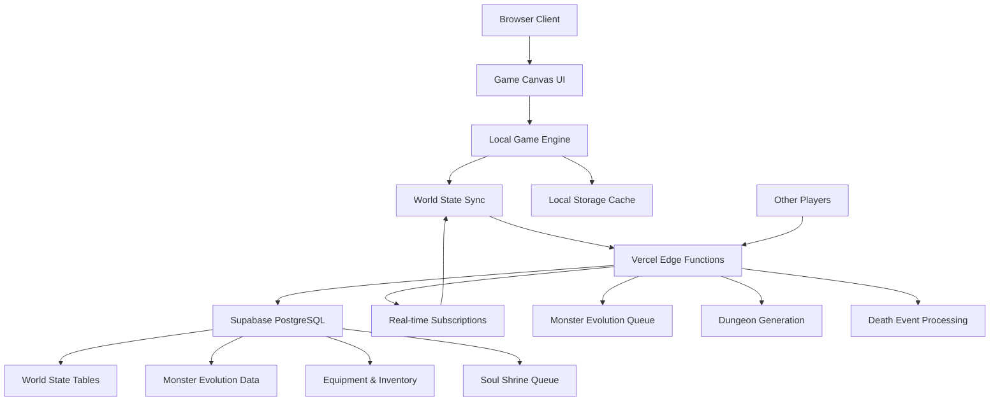
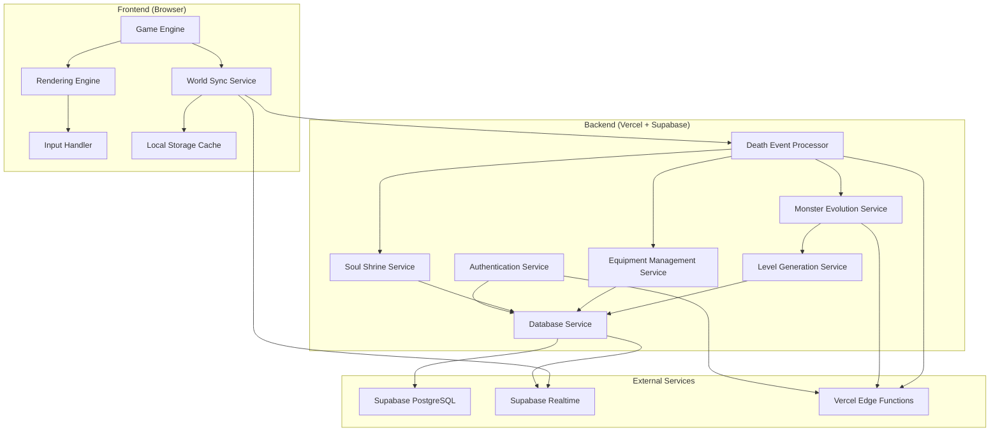
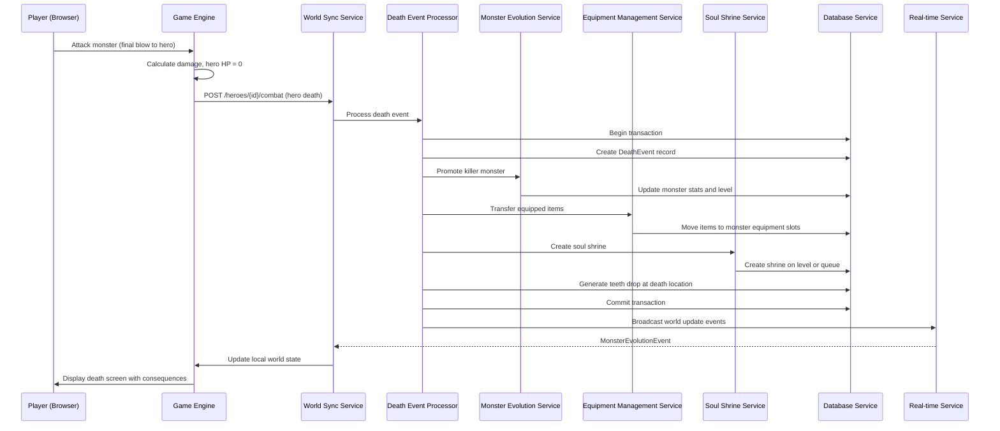
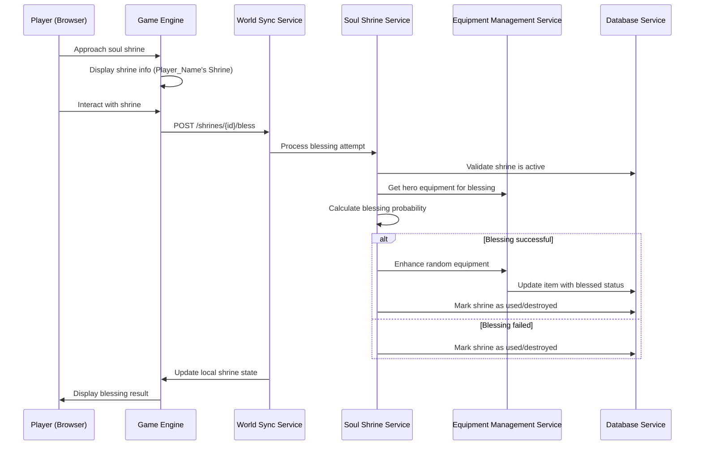
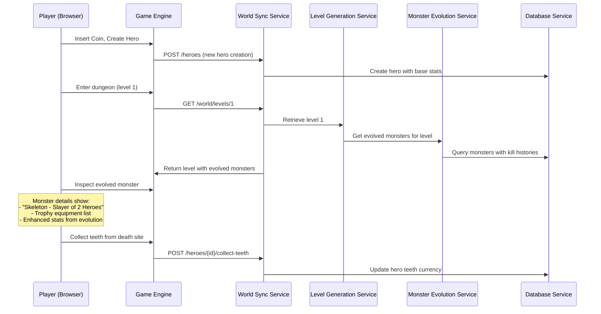
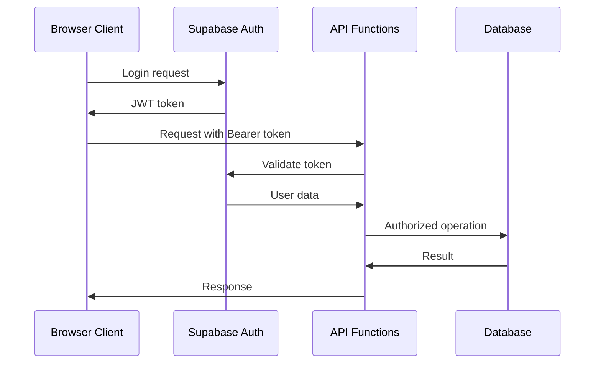
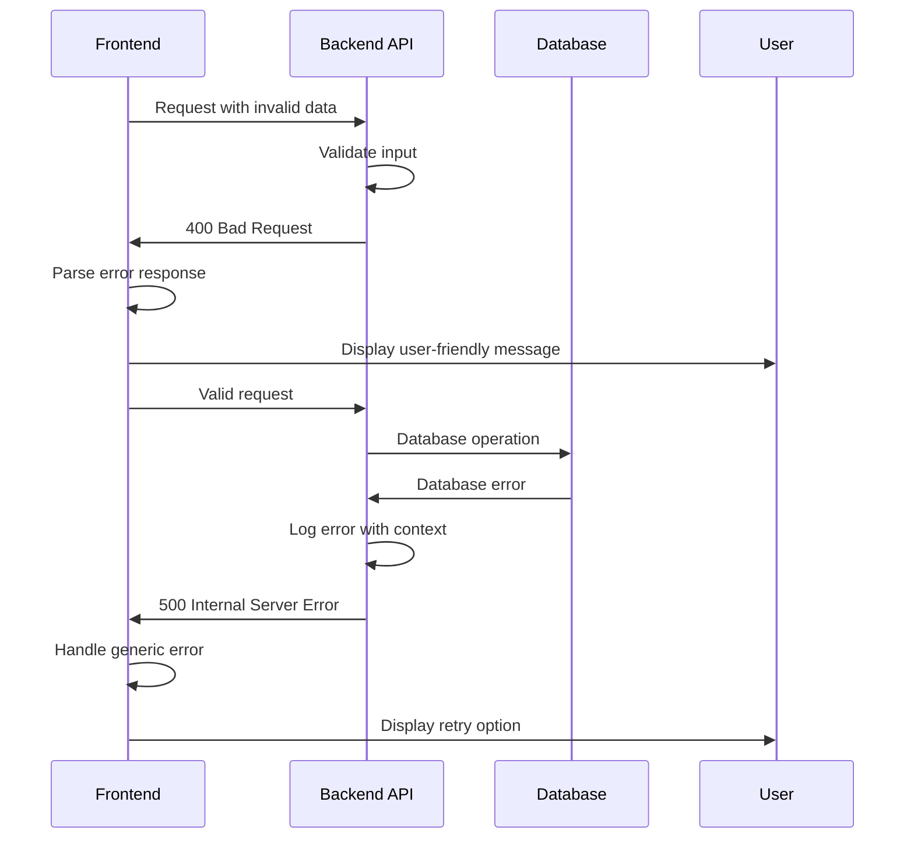

# Larn-Like Dungeon Crawler Fullstack Architecture Document

*Generated using Fullstack Architecture Template v2.0*
*Last Updated: 2025-09-28*

---

## Introduction

This document outlines the complete fullstack architecture for **Larn-Like Dungeon Crawler**, including backend systems, frontend implementation, and their integration. It serves as the single source of truth for AI-driven development, ensuring consistency across the entire technology stack.

The unified approach combines what would traditionally be separate backend and frontend architecture documents, streamlining the development process for this modern fullstack application where client-side game mechanics and server-side world persistence are deeply intertwined.

### Starter Template or Existing Project

**Decision:** Greenfield project with custom vanilla TypeScript frontend and Vercel/Supabase backend as specified in PRD requirements.

Based on my review of the PRD, this is a greenfield project with specific technology preferences mentioned:
- Frontend: Vanilla TypeScript with Canvas 2D API
- Backend: Vercel serverless functions with Supabase PostgreSQL
- Monorepo structure with shared TypeScript interfaces

Given the specific Canvas 2D ASCII rendering requirements and performance targets (60fps, sub-200ms), I recommend proceeding with the custom vanilla approach as specified in the PRD to maintain maximum control over rendering optimization.

### Change Log

| Date | Version | Description | Author |
|------|---------|-------------|---------|
| 2025-09-28 | v1.0 | Initial architecture creation based on PRD v1.3 and UI/UX Specification v1.0 | Winston (Architect) |

---

## High Level Architecture

### Technical Summary

This architecture implements a **local-first hybrid roguelike** combining client-side ASCII rendering with server-side persistent world state. The frontend uses vanilla TypeScript with optimized Canvas 2D rendering to achieve 60fps performance for traditional roguelike gameplay, while Vercel serverless functions and Supabase PostgreSQL maintain the innovative persistent world mechanics where player deaths create permanent monster evolutions and environmental changes.

The system prioritizes responsive local gameplay (sub-200ms input response) while seamlessly synchronizing world state changes across sessions and devices. Core game mechanics execute client-side for optimal performance, with strategic backend synchronization for world persistence, monster evolution tracking, and infinite dungeon generation. This architecture supports unlimited scaling through efficient data structures, evolved monster queue management, and procedural content generation.

### Platform and Infrastructure Choice

**Platform:** Vercel (Frontend + Serverless Functions)
**Key Services:** Supabase PostgreSQL, Supabase Realtime, Vercel Edge Functions
**Deployment Host and Regions:** Global edge deployment via Vercel CDN

**Rationale:** Vercel + Supabase provides native TypeScript support, serverless functions ideal for event-driven game processing, real-time subscriptions for world state sync, and excellent developer experience for rapid iteration.

### Repository Structure

**Structure:** Monorepo with workspace-based organization
**Monorepo Tool:** npm workspaces (lightweight, no additional tooling complexity)
**Package Organization:** Clear separation between apps (game client, api), shared packages (types, utils), and configuration

### High Level Architecture Diagram



### Architectural Patterns

- **Local-First Architecture:** Game mechanics execute client-side with background synchronization - _Rationale:_ Ensures responsive gameplay while maintaining persistent world state across sessions

- **Event Sourcing for World Changes:** Death events, monster promotions, and equipment transfers tracked as immutable events - _Rationale:_ Enables reliable world state reconstruction and debugging of complex evolution chains

- **Canvas-Based Rendering with Dirty Rectangles:** ASCII characters rendered using optimized Canvas 2D with selective updates - _Rationale:_ Achieves 60fps performance targets while maintaining authentic roguelike aesthetic

- **Queue-Based Monster Management:** Evolved monsters managed through priority queues for level population - _Rationale:_ Handles infinite scaling and complex monster evolution without performance degradation

- **Hybrid Online/Offline State:** Local state cache with eventual consistency synchronization - _Rationale:_ Supports offline play while ensuring world changes persist across devices and sessions

---

## Infrastructure Setup & Configuration

### Supabase Service Configuration

**Purpose:** Complete setup procedures for Supabase backend services including database, authentication, and real-time subscriptions.

#### Account Setup & Service Provisioning

**1. Supabase Account Creation:**
```bash
# Visit https://supabase.com and create account
# Choose appropriate plan (Free tier for development, Pro for production)
# Create new project: "larn-like-dev" and "larn-like-prod"
```

**2. Database Configuration:**
```sql
-- Enable required extensions
CREATE EXTENSION IF NOT EXISTS "uuid-ossp";

-- Create initial schema using provided SQL schema
-- Configure Row Level Security (RLS) policies
ALTER TABLE players ENABLE ROW LEVEL SECURITY;
ALTER TABLE heroes ENABLE ROW LEVEL SECURITY;
ALTER TABLE equipment_items ENABLE ROW LEVEL SECURITY;
-- (Continue for all tables)

-- Create RLS policies for secure data access
CREATE POLICY "Players can access own data" ON players
FOR ALL USING (auth.uid()::text = auth_id);

CREATE POLICY "Heroes belong to player" ON heroes
FOR ALL USING (player_id IN (SELECT id FROM players WHERE auth_id = auth.uid()::text));
```

**3. Authentication Service Setup:**
```javascript
// Enable authentication providers in Supabase dashboard
// Minimum: Email/Password authentication
// Optional: Google, GitHub OAuth for enhanced user experience
// Configure email templates for registration/password reset
// Set up redirect URLs for production deployment
```

**4. Real-time Subscriptions:**
```sql
-- Enable real-time for required tables
ALTER publication supabase_realtime ADD TABLE monsters;
ALTER publication supabase_realtime ADD TABLE soul_shrines;
ALTER publication supabase_realtime ADD TABLE death_events;
```

#### API Key Management

**Development Environment:**
```bash
# .env.local (never commit to git)
VITE_SUPABASE_URL=https://your-dev-project.supabase.co
VITE_SUPABASE_ANON_KEY=your-dev-anon-key
SUPABASE_SERVICE_ROLE_KEY=your-dev-service-role-key
```

**Production Environment (Vercel):**
```bash
# Configure in Vercel dashboard environment variables
VITE_SUPABASE_URL=https://your-prod-project.supabase.co
VITE_SUPABASE_ANON_KEY=your-prod-anon-key
SUPABASE_SERVICE_ROLE_KEY=your-prod-service-role-key
```

### Database Migration Strategy

**Purpose:** Reliable schema evolution and deployment procedures using Supabase migration tools.

#### Migration Workflow

**1. Initialize Supabase CLI:**
```bash
# Install Supabase CLI globally
npm install -g supabase

# Login and initialize project
supabase login
supabase init

# Link to remote project
supabase link --project-ref your-project-ref
```

**2. Schema Migration Process:**
```bash
# Create new migration
supabase migration new initial_schema

# Apply migrations to local development
supabase db reset

# Push migrations to remote (production)
supabase db push

# Generate TypeScript types from schema
supabase gen types typescript --local > src/types/supabase.ts
```

**3. Migration File Structure:**
```
supabase/
├── config.toml                    # Project configuration
├── migrations/
│   ├── 20231201000001_initial_schema.sql
│   ├── 20231201000002_add_indexes.sql
│   └── 20231201000003_rls_policies.sql
├── seed.sql                       # Development data
└── functions/                     # Edge functions (if needed)
```

#### Schema Versioning & Rollback

**Forward Migration:**
```sql
-- migrations/20231201000001_initial_schema.sql
-- Create tables, indexes, and constraints
-- Include transaction wrapping for atomicity
BEGIN;

CREATE TABLE players (...);
CREATE TABLE heroes (...);
-- ... other tables

COMMIT;
```

**Rollback Procedures:**
```bash
# Rollback to specific migration
supabase db reset --db-url your-database-url

# Manual rollback SQL for production
-- Create rollback scripts for each migration
-- Test rollback procedures in staging environment
```

### Development Environment Setup

**Purpose:** Standardized local development environment with all services integrated and validated.

#### Local Development Stack

**1. Prerequisites Installation:**
```bash
# Node.js 18+ and npm
node --version  # Should be 18+
npm --version   # Should be 9+

# Git for version control
git --version

# Supabase CLI for database management
supabase --version
```

**2. Project Setup:**
```bash
# Clone repository and install dependencies
git clone <repository-url>
cd larn-like
npm install

# Copy environment template
cp .env.example .env.local

# Edit .env.local with your Supabase credentials
# Run initial database setup
supabase start
supabase db reset

# Verify services are running
supabase status
```

**3. Service Integration Testing:**
```typescript
// Create test script: scripts/verify-setup.js
import { createClient } from '@supabase/supabase-js';

const supabase = createClient(
  process.env.VITE_SUPABASE_URL!,
  process.env.VITE_SUPABASE_ANON_KEY!
);

async function verifySetup() {
  // Test database connection
  const { data, error } = await supabase.from('players').select('count');
  console.log('Database connection:', error ? 'FAILED' : 'SUCCESS');

  // Test authentication
  const { data: authData, error: authError } = await supabase.auth.signUp({
    email: 'test@example.com',
    password: 'testpassword123'
  });
  console.log('Authentication:', authError ? 'FAILED' : 'SUCCESS');

  // Test real-time subscriptions
  const subscription = supabase
    .channel('test')
    .on('postgres_changes', { event: '*', schema: 'public', table: 'players' },
        (payload) => console.log('Real-time:', 'SUCCESS'))
    .subscribe();

  console.log('Setup verification complete');
}

verifySetup();
```

#### Development Scripts & Commands

**Package.json additions:**
```json
{
  "scripts": {
    "dev": "concurrently \"npm run dev:web\" \"npm run dev:api\"",
    "dev:web": "vite",
    "dev:api": "vercel dev",
    "db:reset": "supabase db reset",
    "db:migrate": "supabase db push",
    "db:seed": "supabase db seed",
    "db:types": "supabase gen types typescript --local > src/types/supabase.ts",
    "verify-setup": "node scripts/verify-setup.js",
    "build": "npm run build:web && npm run build:api",
    "build:web": "vite build",
    "build:api": "vercel build"
  }
}
```

### Security Configuration

**Purpose:** Secure credential management, access controls, and production security measures.

#### Row Level Security (RLS) Policies

**Player Data Protection:**
```sql
-- players table policies
CREATE POLICY "Players can view own profile" ON players
FOR SELECT USING (auth.uid()::text = auth_id);

CREATE POLICY "Players can update own profile" ON players
FOR UPDATE USING (auth.uid()::text = auth_id);

-- heroes table policies
CREATE POLICY "Players access own heroes" ON heroes
FOR ALL USING (
  player_id IN (
    SELECT id FROM players WHERE auth_id = auth.uid()::text
  )
);
```

**Game Data Access:**
```sql
-- World data (readable by all authenticated users)
CREATE POLICY "World data readable" ON dungeon_levels
FOR SELECT TO authenticated USING (true);

CREATE POLICY "Monster data readable" ON monsters
FOR SELECT TO authenticated USING (true);

-- Equipment modification restricted to owners
CREATE POLICY "Equipment owned by player" ON equipment_items
FOR ALL USING (
  original_owner IN (
    SELECT name FROM heroes WHERE player_id IN (
      SELECT id FROM players WHERE auth_id = auth.uid()::text
    )
  )
);
```

#### Environment Security

**Development Security:**
```bash
# .env.example template
VITE_SUPABASE_URL=your-supabase-project-url
VITE_SUPABASE_ANON_KEY=your-supabase-anon-key
SUPABASE_SERVICE_ROLE_KEY=your-service-role-key
NODE_ENV=development
LOG_LEVEL=debug

# .gitignore additions
.env
.env.local
.env.production
supabase/.env
```

**Production Security:**
```bash
# Vercel environment variables (configured in dashboard)
# Never expose service role key to frontend
# Use environment-specific Supabase projects
# Enable API rate limiting in Supabase dashboard
# Configure CORS origins for production domain
```

---

## Tech Stack

### Technology Stack Table

| Category | Technology | Version | Purpose | Rationale |
|----------|------------|---------|---------|-----------|
| Frontend Language | TypeScript | 5.3+ | Type-safe client-side game logic | Essential for shared interfaces and Canvas API type safety |
| Frontend Framework | Vanilla TypeScript | ES2022+ | Pure Canvas 2D game rendering | Maximum performance control for 60fps ASCII rendering |
| UI Component Library | Custom ASCII Components | - | Roguelike-specific interface elements | No existing library supports ASCII roguelike patterns |
| State Management | Custom Game State | - | Local game state with sync layer | Optimized for roguelike mechanics and world persistence |
| Backend Language | TypeScript | 5.3+ | Serverless function development | Shared types between frontend and backend |
| Backend Framework | Vercel Functions | Latest | Serverless API endpoints | Event-driven architecture for death processing |
| API Style | REST + WebSockets | HTTP/1.1, WS | RESTful actions + real-time updates | REST for commands, WebSockets for world state sync |
| Database | Supabase PostgreSQL | 15+ | Persistent world state storage | Complex relational data for monster evolution |
| Cache | Supabase Realtime | Latest | Live world state synchronization | Real-time updates without polling overhead |
| File Storage | Supabase Storage | Latest | Static assets and save files | Integrated with authentication and database |
| Authentication | Supabase Auth | Latest | User sessions and save data | Built-in OAuth and session management |
| Frontend Testing | Vitest + Testing Library | Latest | Unit and integration tests | Fast testing for game logic and UI components |
| Backend Testing | Vitest | Latest | API endpoint and database tests | Consistent testing stack across frontend/backend |
| E2E Testing | Playwright | Latest | Full gameplay session testing | Cross-browser testing for Canvas rendering |
| Build Tool | Vite | 5+ | Frontend build and dev server | Fast HMR for game development iteration |
| Bundler | Rollup (via Vite) | Latest | Production bundle optimization | Tree shaking for minimal bundle size |
| IaC Tool | Vercel CLI | Latest | Deployment and environment config | Infrastructure as code for reproducible deploys |
| CI/CD | GitHub Actions | Latest | Automated testing and deployment | Integrated with Vercel for seamless deployment |
| Monitoring | Vercel Analytics | Latest | Performance and error tracking | Built-in monitoring for serverless functions |
| Logging | Vercel Logs + Supabase Logs | Latest | Centralized application logging | Distributed logging across serverless architecture |
| CSS Framework | Custom CSS + CSS Modules | CSS3 | ASCII terminal styling | Authentic 1980s terminal aesthetic with modern tooling |

---

## Data Models

### Hero

**Purpose:** Represents a single hero instance with temporary stats and equipment that reset on death

**Key Attributes:**
- id: string - Unique identifier for this hero instance
- playerId: string - Player who owns this hero
- name: string - Player-chosen name (becomes part of equipment naming)
- level: number - Current hero level (resets on death)
- baseStats: HeroStats - Starting stats (consistent across all heroes)
- currentStats: HeroStats - Modified stats from reagents and leveling
- equipment: EquipmentSlots - Currently equipped items (10-slot system)
- inventory: InventoryItem[] - Carried items (limited to 9 items)
- currentLocation: LocationData - Current position in world
- teethCurrency: number - Collected teeth for merchant purchases
- createdAt: Date - When this hero was created
- isAlive: boolean - Current life status

#### TypeScript Interface
```typescript
interface Hero {
  id: string;
  playerId: string;
  name: string;
  level: number;
  baseStats: HeroStats;
  currentStats: HeroStats;
  equipment: EquipmentSlots;
  inventory: InventoryItem[];
  currentLocation: LocationData;
  teethCurrency: number;
  createdAt: Date;
  isAlive: boolean;
}

interface HeroStats {
  hp: number;
  maxHp: number;
  strength: number;
  dexterity: number;
  constitution: number;
}
```

#### Relationships
- Belongs to one Player
- Located in one DungeonLevel
- Can own multiple InventoryItems
- Creates DeathEvents when dying

### Monster

**Purpose:** Represents both baseline and evolved monsters with equipment, kill history, and level placement

**Key Attributes:**
- id: string - Unique monster identifier
- type: MonsterType - Base monster type (skeleton, vampire bat, etc.)
- level: number - Current dungeon level location
- evolutionLevel: number - Number of promotions (0 = baseline)
- stats: MonsterStats - Current stats including evolution bonuses
- equipment: EquipmentSlots - Trophy equipment from killed heroes
- killHistory: KillRecord[] - Heroes this monster has defeated
- isEvolved: boolean - Whether this monster has been promoted
- queuePosition: number | null - Position in evolution queue (null if active)
- lastActive: Date - When monster was last on a dungeon level

#### TypeScript Interface
```typescript
interface Monster {
  id: string;
  type: MonsterType;
  level: number;
  evolutionLevel: number;
  stats: MonsterStats;
  equipment: EquipmentSlots;
  killHistory: KillRecord[];
  isEvolved: boolean;
  queuePosition: number | null;
  lastActive: Date;
}

interface KillRecord {
  heroId: string;
  heroName: string;
  killedAt: Date;
  equipmentTaken: EquipmentItem[];
}
```

#### Relationships
- Located in one DungeonLevel
- Has multiple KillRecords
- Can own multiple EquipmentItems
- Tracked in MonsterEvolutionQueue

### EquipmentItem

**Purpose:** Represents individual pieces of equipment with naming, stats, and blessing status

**Key Attributes:**
- id: string - Unique item identifier
- name: string - Item name including original owner (e.g., "Sarah's Iron Sword")
- type: EquipmentType - Category and slot compatibility
- stats: ItemStats - Stat bonuses provided by this item
- isBlessed: boolean - Whether enhanced by soul shrine
- blessedBy: string | null - Name of soul that blessed this item
- originalOwner: string - First hero to possess this item
- rarity: ItemRarity - Common, rare, unique, etc.
- createdAt: Date - When item first appeared in world

#### TypeScript Interface
```typescript
interface EquipmentItem {
  id: string;
  name: string;
  type: EquipmentType;
  stats: ItemStats;
  isBlessed: boolean;
  blessedBy: string | null;
  originalOwner: string;
  rarity: ItemRarity;
  createdAt: Date;
}

interface EquipmentSlots {
  weapon: EquipmentItem | null;
  offHand: EquipmentItem | null;
  helmet: EquipmentItem | null;
  bodyArmor: EquipmentItem | null;
  gloves: EquipmentItem | null;
  boots: EquipmentItem | null;
  ring1: EquipmentItem | null;
  ring2: EquipmentItem | null;
  amulet: EquipmentItem | null;
  belt: EquipmentItem | null;
}
```

#### Relationships
- Can be equipped by Hero or Monster
- Can be stored in DungeonChest
- Can be blessed by SoulShrine
- Originates from one Player

### DungeonLevel

**Purpose:** Represents procedurally generated dungeon floors with persistent layout and contents

**Key Attributes:**
- id: string - Unique level identifier
- depth: number - Level depth (1, 2, 3, etc.)
- layout: LevelLayout - Procedurally generated room and corridor data
- monsters: Monster[] - Currently active monsters on this level
- chests: DungeonChest[] - Equipment storage chests
- teethLocations: TeethDrop[] - Currency drops from hero deaths
- shrines: SoulShrine[] - Active soul shrines for blessing
- generatedAt: Date - When level was first created
- lastRegenerated: Date - When monster population was last updated

#### TypeScript Interface
```typescript
interface DungeonLevel {
  id: string;
  depth: number;
  layout: LevelLayout;
  monsters: Monster[];
  chests: DungeonChest[];
  teethLocations: TeethDrop[];
  shrines: SoulShrine[];
  generatedAt: Date;
  lastRegenerated: Date;
}

interface LevelLayout {
  width: number;
  height: number;
  rooms: Room[];
  corridors: Corridor[];
  stairsUp: Position;
  stairsDown: Position;
}
```

#### Relationships
- Contains multiple Monsters
- Contains multiple DungeonChests
- Contains multiple TeethDrops
- Contains multiple SoulShrines

### SoulShrine

**Purpose:** Represents blessing stations created by trapped souls from hero deaths

**Key Attributes:**
- id: string - Unique shrine identifier
- heroName: string - Name of hero whose soul created this shrine
- level: number - Dungeon level where shrine appears
- position: Position - Exact coordinates within level
- isActive: boolean - Whether shrine can still grant blessings
- blessingsGranted: number - How many times this shrine has been used
- createdAt: Date - When shrine was created from death event
- queuePosition: number | null - Position in shrine queue if not yet placed

#### TypeScript Interface
```typescript
interface SoulShrine {
  id: string;
  heroName: string;
  level: number;
  position: Position;
  isActive: boolean;
  blessingsGranted: number;
  createdAt: Date;
  queuePosition: number | null;
}

interface Position {
  x: number;
  y: number;
}
```

#### Relationships
- Created by one Hero death
- Located in one DungeonLevel
- Can bless multiple EquipmentItems

### DeathEvent

**Purpose:** Immutable record of hero deaths and their world consequences for event sourcing

**Key Attributes:**
- id: string - Unique event identifier
- heroId: string - Hero who died
- heroName: string - Name for equipment attribution
- killerMonsterId: string - Monster that dealt killing blow
- location: Position - Exact death coordinates
- teethDropped: number - Currency generated (1-32)
- equipmentTransferred: EquipmentItem[] - Items given to killer monster
- equipmentScattered: EquipmentItem[] - Items distributed to chests
- soulShrineCreated: boolean - Whether death created shrine
- processedAt: Date - When world changes were applied

#### TypeScript Interface
```typescript
interface DeathEvent {
  id: string;
  heroId: string;
  heroName: string;
  killerMonsterId: string;
  location: Position;
  teethDropped: number;
  equipmentTransferred: EquipmentItem[];
  equipmentScattered: EquipmentItem[];
  soulShrineCreated: boolean;
  processedAt: Date;
}
```

#### Relationships
- References one Hero
- References one Monster (killer)
- Creates one SoulShrine
- Creates one TeethDrop
- Transfers multiple EquipmentItems

---

## API Specification

The API design follows the hybrid REST + WebSockets approach from our tech stack, with REST endpoints for user actions and WebSocket connections for real-time world updates. All endpoints use the shared TypeScript interfaces defined in our data models.

### REST API Specification

```yaml
openapi: 3.0.0
info:
  title: Larn-Like Dungeon Crawler API
  version: 1.0.0
  description: RESTful API for game actions and world state management
servers:
  - url: https://api.larn-like.vercel.app
    description: Production API server
  - url: http://localhost:3000/api
    description: Local development server

paths:
  # Hero Management
  /heroes:
    post:
      summary: Create new hero (Insert Coin)
      description: Creates a fresh hero with base stats and starting equipment
      requestBody:
        required: true
        content:
          application/json:
            schema:
              type: object
              properties:
                playerCredits:
                  type: number
                  description: Available credits for hero creation
                heroName:
                  type: string
                  maxLength: 12
                  description: Player-chosen hero name
      responses:
        201:
          description: Hero created successfully
          content:
            application/json:
              schema:
                $ref: '#/components/schemas/Hero'

  /heroes/{heroId}/move:
    post:
      summary: Move hero in dungeon
      description: Process hero movement with collision detection
      parameters:
        - name: heroId
          in: path
          required: true
          schema:
            type: string
      requestBody:
        required: true
        content:
          application/json:
            schema:
              type: object
              properties:
                direction:
                  type: string
                  enum: [north, south, east, west]
                newPosition:
                  $ref: '#/components/schemas/Position'
      responses:
        200:
          description: Movement successful

  /heroes/{heroId}/combat:
    post:
      summary: Execute combat action
      description: Process combat between hero and monster
      parameters:
        - name: heroId
          in: path
          required: true
          schema:
            type: string
      requestBody:
        required: true
        content:
          application/json:
            schema:
              type: object
              properties:
                action:
                  type: string
                  enum: [attack, defend, flee]
                targetMonsterId:
                  type: string
      responses:
        200:
          description: Combat resolved

  # World State Management
  /world/levels/{depth}:
    get:
      summary: Get dungeon level data
      description: Retrieve level layout, monsters, and items
      parameters:
        - name: depth
          in: path
          required: true
          schema:
            type: integer
            minimum: 0
      responses:
        200:
          description: Level data retrieved

  # Equipment and Inventory
  /heroes/{heroId}/inventory:
    get:
      summary: Get hero inventory
      description: Retrieve current inventory and equipment
    put:
      summary: Update hero equipment
      description: Equip/unequip items with slot validation

  # Town and Commerce
  /town/merchant:
    get:
      summary: Get merchant inventory
      description: Retrieve available items for purchase

  /town/merchant/purchase:
    post:
      summary: Purchase item from merchant
      description: Buy equipment using teeth currency

  # Soul Shrine Interactions
  /shrines/{shrineId}/bless:
    post:
      summary: Attempt equipment blessing
      description: Try to enhance equipment using soul shrine

components:
  schemas:
    Hero:
      type: object
      properties:
        id:
          type: string
        name:
          type: string
        level:
          type: integer
        isAlive:
          type: boolean

    Error:
      type: object
      properties:
        error:
          type: object
          properties:
            code:
              type: string
            message:
              type: string
            timestamp:
              type: string
              format: date-time

security:
  - BearerAuth: []
```

### WebSocket Real-Time Events

**Connection Endpoint:** `wss://api.larn-like.vercel.app/realtime`

```typescript
// Outbound Events (Server → Client)
interface WorldUpdateEvent {
  type: 'world_update';
  data: {
    levelDepth: number;
    changes: {
      monstersAdded?: Monster[];
      monstersRemoved?: string[];
      shrinesAdded?: SoulShrine[];
      shrinesRemoved?: string[];
      teethAdded?: TeethDrop[];
      teethCollected?: string[];
    };
  };
}

interface MonsterEvolutionEvent {
  type: 'monster_evolution';
  data: {
    monsterId: string;
    oldLevel: number;
    newLevel: number;
    equipmentGained: EquipmentItem[];
    killedHero: string;
  };
}

interface ShrineCreatedEvent {
  type: 'shrine_created';
  data: {
    shrine: SoulShrine;
    fromDeath: {
      heroName: string;
      level: number;
    };
  };
}
```

---

## Components

### Game Engine

**Responsibility:** Core client-side game logic including combat, movement, inventory management, and local state coordination

**Key Interfaces:**
- GameState management and mutations
- Canvas rendering coordination
- Input processing and validation
- Local world state caching
- Real-time sync coordination

**Dependencies:** World Sync Service, Rendering Engine, Input Handler

**Technology Stack:** Vanilla TypeScript with custom state management, Canvas 2D API integration, shared data model interfaces

### Rendering Engine

**Responsibility:** ASCII character rendering using Canvas 2D with performance optimization for 60fps roguelike display

**Key Interfaces:**
- Canvas context management
- ASCII character atlas rendering
- Dirty rectangle optimization
- Screen layout coordination (map, inventory, stats panels)
- Green intensity color system

**Dependencies:** Game Engine (for game state), UI Component Library (for interface elements)

**Technology Stack:** Canvas 2D API with optimized character sprite rendering, CSS Modules for terminal styling, TypeScript for type-safe rendering logic

### World Sync Service

**Responsibility:** Bidirectional synchronization between local game state and persistent world database

**Key Interfaces:**
- REST API client for immediate actions
- WebSocket client for real-time updates
- Local cache management
- Conflict resolution for offline/online state
- Event queue for deferred synchronization

**Dependencies:** Game Engine (for state updates), Backend API (for persistence), Local Storage (for offline cache)

**Technology Stack:** Fetch API for REST calls, WebSocket API for real-time events, IndexedDB for local caching, custom retry/queue logic

### Death Event Processor

**Responsibility:** Server-side processing of hero deaths including monster promotion, equipment transfer, and shrine creation

**Key Interfaces:**
- Death event validation and processing
- Monster evolution queue management
- Equipment distribution algorithms
- Soul shrine placement logic
- World state mutation coordination

**Dependencies:** Database Service, Monster Evolution Service, Equipment Management Service

**Technology Stack:** Vercel serverless functions with TypeScript, Supabase PostgreSQL for persistence, event sourcing patterns

### Monster Evolution Service

**Responsibility:** Managing monster promotions, kill tracking, and evolved monster queue system for infinite scaling

**Key Interfaces:**
- Monster promotion processing
- Kill history management
- Evolution queue prioritization
- Level population algorithms
- Stat enhancement calculations

**Dependencies:** Database Service, Level Generation Service

**Technology Stack:** TypeScript serverless functions, PostgreSQL for evolution tracking, queue management algorithms

### Level Generation Service

**Responsibility:** Procedural dungeon generation with persistent layout storage and monster population management

**Key Interfaces:**
- Procedural layout algorithms
- Level persistence and caching
- Monster density calculations
- Chest and item placement
- Stairs and connectivity validation

**Dependencies:** Database Service, Monster Evolution Service

**Technology Stack:** TypeScript with procedural generation algorithms, PostgreSQL for level storage, caching strategies for frequently accessed levels

### Equipment Management Service

**Responsibility:** Complex equipment constraints, blessing mechanics, and inventory validation across heroes and monsters

**Key Interfaces:**
- 10-slot equipment validation
- Blessing probability and enhancement
- Inventory overflow management
- Equipment naming and ownership tracking
- Stat calculation and bonuses

**Dependencies:** Database Service, Soul Shrine Service

**Technology Stack:** TypeScript with complex validation logic, PostgreSQL for equipment tracking, shared validation utilities

### Soul Shrine Service

**Responsibility:** Soul shrine creation, placement queue management, and blessing interaction processing

**Key Interfaces:**
- Shrine creation from death events
- Queue-based placement algorithms
- Blessing probability calculations
- Equipment enhancement processing
- Shrine lifecycle management

**Dependencies:** Database Service, Equipment Management Service, Level Generation Service

**Technology Stack:** TypeScript serverless functions, PostgreSQL for shrine tracking, RNG algorithms for blessing mechanics

### Database Service

**Responsibility:** Centralized data persistence with optimized queries for game performance and infinite scaling requirements

**Key Interfaces:**
- CRUD operations for all data models
- Complex relationship queries
- Transaction management for world changes
- Performance optimization and indexing
- Real-time subscription coordination

**Dependencies:** Supabase PostgreSQL, Supabase Realtime

**Technology Stack:** Supabase client libraries, PostgreSQL with optimized schemas, real-time subscriptions for live updates

### Authentication Service

**Responsibility:** Player session management, hero ownership validation, and secure API access coordination

**Key Interfaces:**
- JWT token validation
- Player session management
- Hero ownership verification
- API request authorization
- Session persistence across devices

**Dependencies:** Database Service

**Technology Stack:** Supabase Auth with JWT tokens, middleware functions for API protection, session management utilities

### Component Diagrams



---

## Core Workflows

### Hero Death and World Evolution Workflow



### Soul Shrine Blessing Interaction Workflow



### New Hero World Discovery Workflow



---

## Database Schema

```sql
-- Enable UUID extension for globally unique identifiers
CREATE EXTENSION IF NOT EXISTS "uuid-ossp";

-- Players table for authentication and session management
CREATE TABLE players (
    id UUID PRIMARY KEY DEFAULT uuid_generate_v4(),
    auth_id TEXT UNIQUE NOT NULL, -- Supabase auth user ID
    username VARCHAR(50) UNIQUE NOT NULL,
    credits INTEGER DEFAULT 3,
    created_at TIMESTAMP WITH TIME ZONE DEFAULT NOW(),
    last_active TIMESTAMP WITH TIME ZONE DEFAULT NOW()
);

-- Heroes table with temporary progression that resets on death
CREATE TABLE heroes (
    id UUID PRIMARY KEY DEFAULT uuid_generate_v4(),
    player_id UUID NOT NULL REFERENCES players(id) ON DELETE CASCADE,
    name VARCHAR(12) NOT NULL, -- Limited for equipment naming
    level INTEGER DEFAULT 1,
    base_hp INTEGER DEFAULT 30,
    base_strength INTEGER DEFAULT 10,
    base_dexterity INTEGER DEFAULT 10,
    base_constitution INTEGER DEFAULT 10,
    current_hp INTEGER DEFAULT 30,
    current_strength DECIMAL(3,1) DEFAULT 10.0, -- Support +0.1 reagent bonuses
    current_dexterity DECIMAL(3,1) DEFAULT 10.0,
    current_constitution DECIMAL(3,1) DEFAULT 10.0,
    teeth_currency INTEGER DEFAULT 0,
    current_level INTEGER DEFAULT 0, -- Dungeon level (0 = town)
    position_x INTEGER DEFAULT 0,
    position_y INTEGER DEFAULT 0,
    is_alive BOOLEAN DEFAULT TRUE,
    created_at TIMESTAMP WITH TIME ZONE DEFAULT NOW(),

    -- Indexes for performance
    INDEX idx_heroes_player_alive (player_id, is_alive),
    INDEX idx_heroes_location (current_level, position_x, position_y)
);

-- Equipment items with naming and blessing support
CREATE TABLE equipment_items (
    id UUID PRIMARY KEY DEFAULT uuid_generate_v4(),
    name VARCHAR(50) NOT NULL, -- "Sarah's Iron Sword" format
    base_name VARCHAR(30) NOT NULL, -- "Iron Sword" without owner
    type VARCHAR(20) NOT NULL, -- weapon, helmet, bodyArmor, etc.
    subtype VARCHAR(20), -- sword, dagger, ring, etc.
    original_owner VARCHAR(12) NOT NULL, -- First hero to possess this item
    is_blessed BOOLEAN DEFAULT FALSE,
    blessed_by VARCHAR(12), -- Soul shrine hero name

    -- Stat bonuses
    attack_bonus INTEGER DEFAULT 0,
    defense_bonus INTEGER DEFAULT 0,
    hp_bonus INTEGER DEFAULT 0,
    strength_bonus INTEGER DEFAULT 0,
    dexterity_bonus INTEGER DEFAULT 0,
    constitution_bonus INTEGER DEFAULT 0,

    rarity VARCHAR(20) DEFAULT 'common', -- common, rare, unique
    created_at TIMESTAMP WITH TIME ZONE DEFAULT NOW(),

    -- Constraints
    CONSTRAINT valid_equipment_type CHECK (type IN (
        'weapon', 'offHand', 'helmet', 'bodyArmor', 'gloves',
        'boots', 'ring', 'amulet', 'belt'
    )),

    -- Indexes
    INDEX idx_equipment_type (type),
    INDEX idx_equipment_blessed (is_blessed),
    INDEX idx_equipment_owner (original_owner)
);

-- Hero equipment slots (10-slot system)
CREATE TABLE hero_equipment (
    hero_id UUID NOT NULL REFERENCES heroes(id) ON DELETE CASCADE,
    slot VARCHAR(20) NOT NULL,
    item_id UUID REFERENCES equipment_items(id) ON DELETE SET NULL,

    PRIMARY KEY (hero_id, slot),

    CONSTRAINT valid_slot CHECK (slot IN (
        'weapon', 'offHand', 'helmet', 'bodyArmor', 'gloves',
        'boots', 'ring1', 'ring2', 'amulet', 'belt'
    ))
);

-- Dungeon levels with procedural layout persistence
CREATE TABLE dungeon_levels (
    id UUID PRIMARY KEY DEFAULT uuid_generate_v4(),
    depth INTEGER UNIQUE NOT NULL,
    width INTEGER NOT NULL,
    height INTEGER NOT NULL,
    layout_data JSONB NOT NULL, -- Rooms, corridors, stairs positions
    stairs_up_x INTEGER,
    stairs_up_y INTEGER,
    stairs_down_x INTEGER NOT NULL,
    stairs_down_y INTEGER NOT NULL,
    generated_at TIMESTAMP WITH TIME ZONE DEFAULT NOW(),
    last_regenerated TIMESTAMP WITH TIME ZONE DEFAULT NOW(),

    -- Constraints
    CONSTRAINT positive_depth CHECK (depth >= 0),
    CONSTRAINT positive_dimensions CHECK (width > 0 AND height > 0),

    -- Indexes
    INDEX idx_levels_depth (depth),
    INDEX idx_levels_regeneration (last_regenerated)
);

-- Monster types and baseline stats
CREATE TABLE monster_types (
    id UUID PRIMARY KEY DEFAULT uuid_generate_v4(),
    name VARCHAR(30) UNIQUE NOT NULL, -- skeleton, vampire_bat, rat
    ascii_char CHAR(1) NOT NULL, -- S, V, R
    base_hp INTEGER NOT NULL,
    base_attack INTEGER NOT NULL,
    base_defense INTEGER DEFAULT 0,
    spawn_weight INTEGER DEFAULT 1 -- For random generation
);

-- Individual monster instances with evolution tracking
CREATE TABLE monsters (
    id UUID PRIMARY KEY DEFAULT uuid_generate_v4(),
    type_id UUID NOT NULL REFERENCES monster_types(id),
    current_level INTEGER NOT NULL REFERENCES dungeon_levels(depth),
    position_x INTEGER NOT NULL,
    position_y INTEGER NOT NULL,
    evolution_level INTEGER DEFAULT 0, -- Number of promotions

    -- Current stats (modified by evolution)
    current_hp INTEGER NOT NULL,
    max_hp INTEGER NOT NULL,
    current_attack INTEGER NOT NULL,
    current_defense INTEGER DEFAULT 0,

    is_evolved BOOLEAN DEFAULT FALSE,
    queue_position INTEGER, -- NULL if active, number if queued
    last_active TIMESTAMP WITH TIME ZONE DEFAULT NOW(),
    created_at TIMESTAMP WITH TIME ZONE DEFAULT NOW(),

    -- Indexes for performance
    INDEX idx_monsters_level (current_level),
    INDEX idx_monsters_position (current_level, position_x, position_y),
    INDEX idx_monsters_queue (queue_position) WHERE queue_position IS NOT NULL,
    INDEX idx_monsters_evolved (is_evolved, evolution_level)
);

-- Soul shrines created from hero deaths
CREATE TABLE soul_shrines (
    id UUID PRIMARY KEY DEFAULT uuid_generate_v4(),
    hero_name VARCHAR(12) NOT NULL, -- Name of soul that created shrine
    level_depth INTEGER NOT NULL REFERENCES dungeon_levels(depth),
    position_x INTEGER NOT NULL,
    position_y INTEGER NOT NULL,
    is_active BOOLEAN DEFAULT TRUE,
    blessings_granted INTEGER DEFAULT 0,
    queue_position INTEGER, -- NULL if placed, number if queued
    created_at TIMESTAMP WITH TIME ZONE DEFAULT NOW(),

    -- Only one active shrine per position
    UNIQUE(level_depth, position_x, position_y) WHERE is_active = TRUE,

    INDEX idx_shrines_level (level_depth),
    INDEX idx_shrines_active (is_active),
    INDEX idx_shrines_queue (queue_position) WHERE queue_position IS NOT NULL
);

-- Death events for event sourcing and audit trail
CREATE TABLE death_events (
    id UUID PRIMARY KEY DEFAULT uuid_generate_v4(),
    hero_id UUID NOT NULL REFERENCES heroes(id),
    hero_name VARCHAR(12) NOT NULL,
    killer_monster_id UUID NOT NULL REFERENCES monsters(id),
    death_level INTEGER NOT NULL,
    death_x INTEGER NOT NULL,
    death_y INTEGER NOT NULL,
    teeth_dropped INTEGER NOT NULL CHECK (teeth_dropped BETWEEN 1 AND 32),
    soul_shrine_created BOOLEAN DEFAULT TRUE,
    processed_at TIMESTAMP WITH TIME ZONE DEFAULT NOW(),

    -- Event sourcing data
    equipment_transferred JSONB, -- Items given to killer
    equipment_scattered JSONB, -- Items distributed to chests

    INDEX idx_deaths_time (processed_at),
    INDEX idx_deaths_location (death_level, death_x, death_y),
    INDEX idx_deaths_monster (killer_monster_id)
);

-- Performance optimizations
CREATE INDEX CONCURRENTLY idx_monsters_level_active ON monsters(current_level) WHERE queue_position IS NULL;
CREATE INDEX CONCURRENTLY idx_equipment_search ON equipment_items(type, rarity, is_blessed);

-- Views for common queries
CREATE VIEW active_monsters AS
SELECT m.*, mt.name as type_name, mt.ascii_char
FROM monsters m
JOIN monster_types mt ON m.type_id = mt.id
WHERE m.queue_position IS NULL;

CREATE VIEW evolved_monsters_summary AS
SELECT m.id, mt.name as type_name, m.current_level, m.evolution_level,
       COUNT(mk.id) as kill_count,
       ARRAY_AGG(mk.hero_name ORDER BY mk.killed_at) as victims
FROM monsters m
JOIN monster_types mt ON m.type_id = mt.id
LEFT JOIN monster_kills mk ON m.id = mk.monster_id
WHERE m.is_evolved = TRUE
GROUP BY m.id, mt.name, m.current_level, m.evolution_level;
```

---

## Frontend Architecture

### Component Architecture

#### Component Organization

```
src/
├── core/                      # Core game engine
│   ├── GameEngine.ts         # Main game coordination
│   ├── GameState.ts          # Local state management
│   ├── InputHandler.ts       # Keyboard/mouse input
│   └── GameLoop.ts           # 60fps render loop
├── rendering/                # Canvas 2D rendering system
│   ├── CanvasRenderer.ts     # Main rendering coordinator
│   ├── ASCIIAtlas.ts         # Character sprite management
│   ├── ColorManager.ts       # Green intensity system
│   └── LayoutManager.ts      # Screen layout (map, UI panels)
├── game/                     # Game logic modules
│   ├── Hero.ts               # Hero state and actions
│   ├── Monster.ts            # Monster behavior and evolution
│   ├── Equipment.ts          # 10-slot equipment system
│   ├── Inventory.ts          # Inventory management
│   ├── Combat.ts             # Turn-based combat logic
│   └── Movement.ts           # Movement and collision
├── world/                    # World state and sync
│   ├── WorldState.ts         # Persistent world management
│   ├── LevelManager.ts       # Dungeon level handling
│   ├── SyncService.ts        # Backend synchronization
│   └── CacheManager.ts       # Local storage cache
├── ui/                       # UI components and screens
│   ├── TitleScreen.ts        # Insert Coin interface
│   ├── GameHUD.ts            # Main game interface
│   ├── DeathScreen.ts        # Full-screen death display
│   ├── InventoryPanel.ts     # Equipment management
│   └── HelpOverlay.ts        # Hotkey reference
├── services/                 # External service integration
│   ├── ApiClient.ts          # REST API communication
│   ├── WebSocketClient.ts    # Real-time updates
│   ├── AuthService.ts        # Supabase authentication
│   └── StorageService.ts     # Local persistence
├── types/                    # Shared type definitions
│   ├── GameTypes.ts          # Game-specific interfaces
│   ├── WorldTypes.ts         # World state interfaces
│   └── ApiTypes.ts           # API request/response types
└── utils/                    # Utility functions
    ├── ASCII.ts              # ASCII character utilities
    ├── Collision.ts          # Collision detection
    ├── Random.ts             # Deterministic RNG
    └── Performance.ts        # Performance monitoring
```

### State Management Architecture

#### State Structure

```typescript
// Central game state following local-first principles
interface GameState {
  // Local game state (resets per hero)
  currentHero: Hero | null;
  localLevel: DungeonLevel | null;
  inputState: InputState;
  uiState: UIState;

  // Persistent world state (synced with backend)
  worldLevels: Map<number, DungeonLevel>;
  evolvedMonsters: Map<string, Monster>;
  soulShrines: Map<string, SoulShrine>;
  teethDrops: Map<string, TeethDrop>;

  // Sync coordination
  pendingActions: Action[];
  lastSyncTimestamp: number;
  isOnline: boolean;
  syncQueue: SyncEvent[];
}
```

#### State Management Patterns

- **Local-First Updates:** All game actions update local state immediately for responsive feel
- **Event Sourcing:** Actions are immutable events that can be replayed for state reconstruction
- **Selective Synchronization:** Only world-changing events (deaths, equipment changes) sync to backend
- **Optimistic Updates:** UI updates immediately while background sync ensures persistence
- **Conflict Resolution:** Last-write-wins for most cases, with manual resolution for complex conflicts

---

## Backend Architecture

### Service Architecture

#### Serverless Architecture

##### Function Organization

```
api/
├── heroes/
│   ├── create.ts            # POST /heroes
│   ├── move.ts              # POST /heroes/{id}/move
│   ├── combat.ts            # POST /heroes/{id}/combat
│   └── inventory.ts         # GET/PUT /heroes/{id}/inventory
├── world/
│   ├── levels.ts            # GET/POST /world/levels/{depth}
│   └── generate.ts          # Level generation logic
├── town/
│   ├── merchant.ts          # GET /town/merchant
│   └── purchase.ts          # POST /town/merchant/purchase
├── shrines/
│   └── bless.ts             # POST /shrines/{id}/bless
├── events/
│   ├── death-processor.ts   # Death event handling
│   ├── monster-evolution.ts # Monster promotion logic
│   └── shrine-queue.ts      # Shrine placement management
└── shared/
    ├── database.ts          # Supabase client setup
    ├── auth.ts              # Authentication middleware
    └── types.ts             # Shared type definitions
```

##### Function Template

```typescript
// Standard serverless function pattern
import { NextRequest, NextResponse } from 'next/server';
import { createClient } from '@supabase/supabase-js';
import { authenticate } from '../shared/auth';

export async function POST(request: NextRequest) {
  try {
    // Authentication
    const user = await authenticate(request);

    // Parse and validate input
    const body = await request.json();
    // Input validation using shared types

    // Database operations
    const supabase = createClient(
      process.env.SUPABASE_URL!,
      process.env.SUPABASE_ANON_KEY!
    );

    // Business logic
    const result = await processBusinessLogic(body, user, supabase);

    // Return response
    return NextResponse.json(result);

  } catch (error) {
    console.error('Function error:', error);
    return NextResponse.json(
      { error: 'Internal server error' },
      { status: 500 }
    );
  }
}
```

### Database Architecture

#### Schema Design

The database schema implements efficient storage for monster evolution, equipment management, and infinite dungeon scaling with optimized indexes and views for performance.

#### Data Access Layer

```typescript
// Repository pattern for data access
class HeroRepository {
  constructor(private supabase: SupabaseClient) {}

  async createHero(heroData: CreateHeroData): Promise<Hero> {
    const { data, error } = await this.supabase
      .from('heroes')
      .insert({
        player_id: heroData.playerId,
        name: heroData.name,
        // ... other fields
      })
      .select()
      .single();

    if (error) throw new DatabaseError(error.message);
    return this.mapToHero(data);
  }

  async getActiveHero(playerId: string): Promise<Hero | null> {
    const { data, error } = await this.supabase
      .from('heroes')
      .select('*')
      .eq('player_id', playerId)
      .eq('is_alive', true)
      .single();

    if (error && error.code !== 'PGRST116') {
      throw new DatabaseError(error.message);
    }

    return data ? this.mapToHero(data) : null;
  }

  private mapToHero(data: any): Hero {
    return {
      id: data.id,
      playerId: data.player_id,
      name: data.name,
      level: data.level,
      // ... map all fields
    };
  }
}
```

### Authentication and Authorization

#### Auth Flow



#### Middleware/Guards

```typescript
// Authentication middleware for API functions
export async function authenticate(request: NextRequest): Promise<User> {
  const authHeader = request.headers.get('authorization');

  if (!authHeader?.startsWith('Bearer ')) {
    throw new AuthError('Missing or invalid authorization header');
  }

  const token = authHeader.slice(7);

  const supabase = createClient(
    process.env.SUPABASE_URL!,
    process.env.SUPABASE_ANON_KEY!
  );

  const { data: { user }, error } = await supabase.auth.getUser(token);

  if (error || !user) {
    throw new AuthError('Invalid token');
  }

  return user;
}
```

---

## Unified Project Structure

```
larn-like/
├── .github/                    # CI/CD workflows
│   └── workflows/
│       ├── ci.yaml
│       └── deploy.yaml
├── apps/                       # Application packages
│   ├── web/                    # Frontend application
│   │   ├── src/
│   │   │   ├── components/     # UI components
│   │   │   ├── core/           # Game engine
│   │   │   ├── rendering/      # Canvas rendering
│   │   │   ├── game/           # Game logic
│   │   │   ├── world/          # World state
│   │   │   ├── ui/             # UI screens
│   │   │   ├── services/       # API integration
│   │   │   ├── types/          # Type definitions
│   │   │   └── utils/          # Utilities
│   │   ├── public/             # Static assets
│   │   ├── tests/              # Frontend tests
│   │   └── package.json
│   └── api/                    # Backend application
│       ├── src/
│       │   ├── heroes/         # Hero API endpoints
│       │   ├── world/          # World API endpoints
│       │   ├── town/           # Town API endpoints
│       │   ├── shrines/        # Shrine API endpoints
│       │   ├── events/         # Event processing
│       │   └── shared/         # Shared backend utilities
│       ├── tests/              # Backend tests
│       └── package.json
├── packages/                   # Shared packages
│   ├── shared/                 # Shared types/utilities
│   │   ├── src/
│   │   │   ├── types/          # TypeScript interfaces
│   │   │   ├── constants/      # Shared constants
│   │   │   └── utils/          # Shared utilities
│   │   └── package.json
│   ├── ui/                     # Shared UI components
│   │   ├── src/
│   │   └── package.json
│   └── config/                 # Shared configuration
│       ├── eslint/
│       ├── typescript/
│       └── jest/
├── infrastructure/             # IaC definitions
│   └── vercel/
│       └── vercel.json
├── scripts/                    # Build/deploy scripts
├── docs/                       # Documentation
│   ├── prd.md
│   ├── front-end-spec.md
│   └── architecture.md
├── .env.example                # Environment template
├── package.json                # Root package.json
├── package-lock.json           # NPM workspace lock
└── README.md
```

---

## Development Workflow

### Local Development Setup

#### Prerequisites
```bash
# Install Node.js 18+ and npm
node --version  # 18+
npm --version   # 9+

# Install dependencies
npm install
```

#### Initial Setup
```bash
# Clone repository
git clone <repository-url>
cd larn-like

# Install dependencies
npm install

# Setup environment variables
cp .env.example .env.local
# Edit .env.local with your Supabase credentials

# Run database migrations
npm run db:migrate

# Seed initial data
npm run db:seed
```

#### Development Commands
```bash
# Start all services
npm run dev

# Start frontend only
npm run dev:web

# Start backend only
npm run dev:api

# Run tests
npm run test
npm run test:e2e
npm run test:coverage
```

### Environment Configuration

#### Required Environment Variables
```bash
# Frontend (.env.local)
VITE_SUPABASE_URL=your-supabase-url
VITE_SUPABASE_ANON_KEY=your-supabase-anon-key
VITE_API_BASE_URL=http://localhost:3000/api

# Backend (.env)
SUPABASE_URL=your-supabase-url
SUPABASE_ANON_KEY=your-supabase-anon-key
SUPABASE_SERVICE_ROLE_KEY=your-service-role-key
DATABASE_URL=your-database-connection-string

# Shared
NODE_ENV=development
LOG_LEVEL=debug
```

---

## Deployment Architecture

### Deployment Strategy

**Frontend Deployment:**
- **Platform:** Vercel Edge Network
- **Build Command:** `npm run build:web`
- **Output Directory:** `apps/web/dist`
- **CDN/Edge:** Global edge deployment with automatic optimization

**Backend Deployment:**
- **Platform:** Vercel Serverless Functions
- **Build Command:** `npm run build:api`
- **Deployment Method:** Automatic deployment via Vercel CLI

### CI/CD Pipeline

```yaml
# .github/workflows/ci.yaml
name: CI/CD Pipeline

on:
  push:
    branches: [main, develop]
  pull_request:
    branches: [main]

jobs:
  test:
    runs-on: ubuntu-latest
    steps:
      - uses: actions/checkout@v4
      - uses: actions/setup-node@v4
        with:
          node-version: '18'
          cache: 'npm'

      - run: npm ci
      - run: npm run lint
      - run: npm run type-check
      - run: npm run test
      - run: npm run test:e2e

  deploy:
    needs: test
    runs-on: ubuntu-latest
    if: github.ref == 'refs/heads/main'
    steps:
      - uses: actions/checkout@v4
      - uses: actions/setup-node@v4
        with:
          node-version: '18'
          cache: 'npm'

      - run: npm ci
      - run: npm run build

      - name: Deploy to Vercel
        uses: vercel/action@v1
        with:
          vercel-token: ${{ secrets.VERCEL_TOKEN }}
          vercel-org-id: ${{ secrets.VERCEL_ORG_ID }}
          vercel-project-id: ${{ secrets.VERCEL_PROJECT_ID }}
```

### Environments

| Environment | Frontend URL | Backend URL | Purpose |
|-------------|-------------|-------------|---------|
| Development | http://localhost:5173 | http://localhost:3000/api | Local development |
| Staging | https://staging.larn-like.vercel.app | https://staging.larn-like.vercel.app/api | Pre-production testing |
| Production | https://larn-like.vercel.app | https://larn-like.vercel.app/api | Live environment |

---

## Security and Performance

### Security Requirements

**Frontend Security:**
- CSP Headers: `default-src 'self'; script-src 'self' 'unsafe-inline'; connect-src 'self' wss://realtime.supabase.co`
- XSS Prevention: Input sanitization and Content Security Policy
- Secure Storage: JWT tokens in httpOnly cookies, sensitive data encrypted

**Backend Security:**
- Input Validation: Comprehensive validation using shared TypeScript interfaces
- Rate Limiting: 100 requests per minute per IP, 1000 per hour per authenticated user
- CORS Policy: Restricted to allowed origins, credentials included for authenticated requests

**Authentication Security:**
- Token Storage: JWT in secure httpOnly cookies with SameSite protection
- Session Management: Automatic token refresh, secure logout
- Password Policy: Handled by Supabase Auth with best practices

### Performance Optimization

**Frontend Performance:**
- Bundle Size Target: <500KB total bundle size
- Loading Strategy: Code splitting by route, lazy loading for non-critical components
- Caching Strategy: Service Worker for offline play, localStorage for game state

**Backend Performance:**
- Response Time Target: <200ms for all API endpoints
- Database Optimization: Optimized indexes, query performance monitoring
- Caching Strategy: Redis for session data, PostgreSQL query result caching

---

## Testing Strategy

### Testing Pyramid

```
     E2E Tests
    /        \
   Integration Tests
  /            \
Frontend Unit  Backend Unit
```

### Test Organization

#### Frontend Tests
```
apps/web/tests/
├── unit/                    # Component and utility tests
│   ├── components/
│   ├── core/
│   ├── game/
│   └── utils/
├── integration/             # Service integration tests
│   ├── api-client/
│   ├── world-sync/
│   └── auth/
└── e2e/                     # End-to-end gameplay tests
    ├── hero-lifecycle/
    ├── death-mechanics/
    ├── equipment-system/
    └── accessibility/
```

#### Backend Tests
```
apps/api/tests/
├── unit/                    # Function and utility tests
│   ├── heroes/
│   ├── world/
│   ├── events/
│   └── shared/
├── integration/             # Database and service tests
│   ├── database/
│   ├── auth/
│   └── external-apis/
└── load/                    # Performance and load tests
    ├── api-endpoints/
    ├── database-queries/
    └── concurrent-users/
```

#### E2E Tests
```
tests/e2e/
├── complete-gameplay/       # Full game session tests
├── death-mechanics/         # Death and evolution tests
├── equipment-system/        # Equipment and inventory tests
├── accessibility/           # Screen reader and keyboard tests
└── performance/             # Canvas rendering and response time tests
```

### Test Examples

#### Frontend Component Test
```typescript
import { render, screen, fireEvent } from '@testing-library/react';
import { GameEngine } from '../src/core/GameEngine';
import { mockCanvas } from '../test-utils/canvas-mock';

describe('GameEngine', () => {
  it('should handle hero movement correctly', async () => {
    const canvas = mockCanvas();
    const gameEngine = new GameEngine(canvas);

    await gameEngine.initialize();

    // Simulate hero creation
    const hero = await gameEngine.createHero('TestHero');
    expect(hero.name).toBe('TestHero');

    // Test movement
    const initialPosition = hero.currentLocation;
    await gameEngine.moveHero('north');

    expect(hero.currentLocation.y).toBe(initialPosition.y - 1);
  });
});
```

#### Backend API Test
```typescript
import { describe, it, expect } from 'vitest';
import { createMockRequest, createMockSupabase } from '../test-utils';
import { POST as createHero } from '../src/heroes/create';

describe('POST /heroes', () => {
  it('should create a new hero with valid data', async () => {
    const mockSupabase = createMockSupabase();
    const request = createMockRequest({
      body: {
        playerCredits: 3,
        heroName: 'TestHero'
      }
    });

    const response = await createHero(request);
    const result = await response.json();

    expect(response.status).toBe(201);
    expect(result.name).toBe('TestHero');
    expect(result.isAlive).toBe(true);
  });
});
```

#### E2E Test
```typescript
import { test, expect } from '@playwright/test';

test('complete death and evolution cycle', async ({ page }) => {
  await page.goto('/');

  // Insert coin and create hero
  await page.click('[data-testid="insert-coin"]');
  await page.fill('[data-testid="hero-name"]', 'E2EHero');
  await page.click('[data-testid="start-game"]');

  // Navigate to dungeon and engage monster
  await page.keyboard.press('ArrowDown'); // Enter dungeon
  await page.keyboard.press('ArrowRight'); // Move to monster

  // Fight until death
  while (await page.isVisible('[data-testid="hero-hp"]')) {
    await page.keyboard.press('Space'); // Attack
    await page.waitForTimeout(100);
  }

  // Verify death screen shows consequences
  await expect(page.locator('[data-testid="death-screen"]')).toBeVisible();
  await expect(page.locator('text=E2EHero slain by')).toBeVisible();
  await expect(page.locator('text=leveled up and descended')).toBeVisible();

  // Return to title and create new hero
  await page.keyboard.press('Enter');
  await page.click('[data-testid="insert-coin"]');
  await page.fill('[data-testid="hero-name"]', 'E2EHero2');
  await page.click('[data-testid="start-game"]');

  // Verify world changes are visible
  await page.keyboard.press('ArrowDown');
  await expect(page.locator('text=Slayer of 1 Hero')).toBeVisible();
});
```

---

## Coding Standards

### Critical Fullstack Rules

- **Type Sharing:** Always define types in packages/shared and import from there
- **API Calls:** Never make direct HTTP calls - use the service layer
- **Environment Variables:** Access only through config objects, never process.env directly
- **Error Handling:** All API routes must use the standard error handler
- **State Updates:** Never mutate state directly - use proper state management patterns

### Naming Conventions

| Element | Frontend | Backend | Example |
|---------|----------|---------|---------|
| Components | PascalCase | - | `UserProfile.tsx` |
| Hooks | camelCase with 'use' | - | `useAuth.ts` |
| API Routes | - | kebab-case | `/api/user-profile` |
| Database Tables | - | snake_case | `user_profiles` |

---

## Error Handling Strategy

### Error Flow



### Error Response Format

```typescript
interface ApiError {
  error: {
    code: string;
    message: string;
    details?: Record<string, any>;
    timestamp: string;
    requestId: string;
  };
}
```

### Frontend Error Handling

```typescript
class ErrorHandler {
  static handle(error: ApiError, context: string): void {
    // Log error for debugging
    console.error(`Error in ${context}:`, error);

    // Show user-friendly message
    const message = this.getUserMessage(error.error.code);
    toast.error(message);

    // Track error for monitoring
    analytics.track('error', {
      code: error.error.code,
      context,
      requestId: error.error.requestId
    });
  }

  private static getUserMessage(code: string): string {
    const messages: Record<string, string> = {
      'INSUFFICIENT_CREDITS': 'Not enough credits to create a new hero',
      'HERO_ALREADY_EXISTS': 'You already have an active hero',
      'INVALID_MOVEMENT': 'Cannot move to that location',
      'EQUIPMENT_SLOT_INVALID': 'Cannot equip item in that slot'
    };

    return messages[code] || 'Something went wrong. Please try again.';
  }
}
```

### Backend Error Handling

```typescript
export function errorHandler(error: Error, context: string): NextResponse {
  const requestId = crypto.randomUUID();

  // Log error with context
  console.error(`[${requestId}] Error in ${context}:`, {
    message: error.message,
    stack: error.stack,
    timestamp: new Date().toISOString()
  });

  // Determine error type and response
  if (error instanceof ValidationError) {
    return NextResponse.json({
      error: {
        code: 'VALIDATION_ERROR',
        message: error.message,
        details: error.details,
        timestamp: new Date().toISOString(),
        requestId
      }
    }, { status: 400 });
  }

  if (error instanceof AuthError) {
    return NextResponse.json({
      error: {
        code: 'UNAUTHORIZED',
        message: 'Authentication required',
        timestamp: new Date().toISOString(),
        requestId
      }
    }, { status: 401 });
  }

  // Generic server error
  return NextResponse.json({
    error: {
      code: 'INTERNAL_ERROR',
      message: 'Internal server error',
      timestamp: new Date().toISOString(),
      requestId
    }
  }, { status: 500 });
}
```

---

## Monitoring and Observability

### Monitoring Stack

- **Frontend Monitoring:** Vercel Analytics for Core Web Vitals and user interactions
- **Backend Monitoring:** Vercel Functions monitoring for serverless performance
- **Error Tracking:** Built-in Vercel error reporting with custom error context
- **Performance Monitoring:** Custom Canvas rendering performance tracking

### Key Metrics

**Frontend Metrics:**
- Core Web Vitals (LCP, FID, CLS)
- JavaScript errors and stack traces
- API response times from client perspective
- User interactions and game session duration

**Backend Metrics:**
- Request rate and response time per endpoint
- Error rate and error types
- Database query performance
- Serverless function cold start times

**Game-Specific Metrics:**
- Canvas rendering performance (frame rate)
- Game session duration and completion rates
- Death event processing time
- Monster evolution queue performance

---

## Checklist Results Report

*This section will be populated after executing the architect checklist validation.*

---

*Fullstack Architecture Complete - Generated with Interactive Mode by Winston (Architect)*