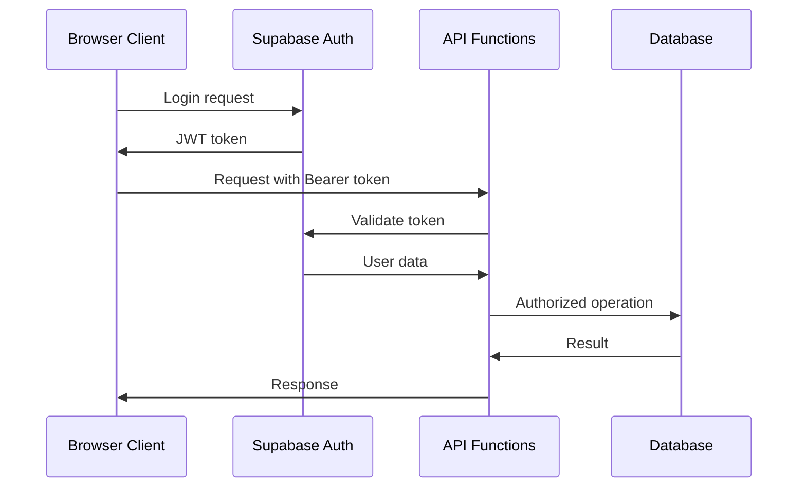

# Backend Architecture

> **PHASE NOTE:** This document describes the full target architecture including cloud services. For Epics 1-4, all persistence is browser-local (localStorage/IndexedDB). Cloud components (Supabase, Vercel Functions, WebSockets, REST API) are deferred to Epic 5. Sections marked **(Epic 5)** do not apply to Epics 1-4.

## Service Architecture

### Serverless Architecture

#### Function Organization

```
api/
├── heroes/
│   ├── create.ts            # POST /heroes
│   ├── move.ts              # POST /heroes/{id}/move
│   ├── combat.ts            # POST /heroes/{id}/combat
│   └── inventory.ts         # GET/PUT /heroes/{id}/inventory
├── world/
│   ├── levels.ts            # GET/POST /world/levels/{depth}
│   └── generate.ts          # Level generation logic
├── town/
│   ├── merchant.ts          # GET /town/merchant
│   └── purchase.ts          # POST /town/merchant/purchase
├── shrines/
│   └── bless.ts             # POST /shrines/{id}/bless
├── events/
│   ├── death-processor.ts   # Death event handling
│   ├── monster-evolution.ts # Monster promotion logic
│   └── shrine-queue.ts      # Shrine placement management
└── shared/
    ├── database.ts          # Supabase client setup
    ├── auth.ts              # Authentication middleware
    └── types.ts             # Shared type definitions
```

#### Function Template

```typescript
// Standard serverless function pattern
import { NextRequest, NextResponse } from 'next/server';
import { createClient } from '@supabase/supabase-js';
import { authenticate } from '../shared/auth';

export async function POST(request: NextRequest) {
  try {
    // Authentication
    const user = await authenticate(request);

    // Parse and validate input
    const body = await request.json();
    // Input validation using shared types

    // Database operations
    const supabase = createClient(
      process.env.SUPABASE_URL!,
      process.env.SUPABASE_ANON_KEY!
    );

    // Business logic
    const result = await processBusinessLogic(body, user, supabase);

    // Return response
    return NextResponse.json(result);

  } catch (error) {
    console.error('Function error:', error);
    return NextResponse.json(
      { error: 'Internal server error' },
      { status: 500 }
    );
  }
}
```

## Database Architecture

### Schema Design

The database schema implements efficient storage for monster evolution, equipment management, and infinite dungeon scaling with optimized indexes and views for performance.

### Data Access Layer

```typescript
// Repository pattern for data access
class HeroRepository {
  constructor(private supabase: SupabaseClient) {}

  async createHero(heroData: CreateHeroData): Promise<Hero> {
    const { data, error } = await this.supabase
      .from('heroes')
      .insert({
        player_id: heroData.playerId,
        name: heroData.name,
        // ... other fields
      })
      .select()
      .single();

    if (error) throw new DatabaseError(error.message);
    return this.mapToHero(data);
  }

  async getActiveHero(playerId: string): Promise<Hero | null> {
    const { data, error } = await this.supabase
      .from('heroes')
      .select('*')
      .eq('player_id', playerId)
      .eq('is_alive', true)
      .single();

    if (error && error.code !== 'PGRST116') {
      throw new DatabaseError(error.message);
    }

    return data ? this.mapToHero(data) : null;
  }

  private mapToHero(data: any): Hero {
    return {
      id: data.id,
      playerId: data.player_id,
      name: data.name,
      level: data.level,
      // ... map all fields
    };
  }
}
```

## Authentication and Authorization

### Auth Flow



### Middleware/Guards

```typescript
// Authentication middleware for API functions
export async function authenticate(request: NextRequest): Promise<User> {
  const authHeader = request.headers.get('authorization');

  if (!authHeader?.startsWith('Bearer ')) {
    throw new AuthError('Missing or invalid authorization header');
  }

  const token = authHeader.slice(7);

  const supabase = createClient(
    process.env.SUPABASE_URL!,
    process.env.SUPABASE_ANON_KEY!
  );

  const { data: { user }, error } = await supabase.auth.getUser(token);

  if (error || !user) {
    throw new AuthError('Invalid token');
  }

  return user;
}
```

---
