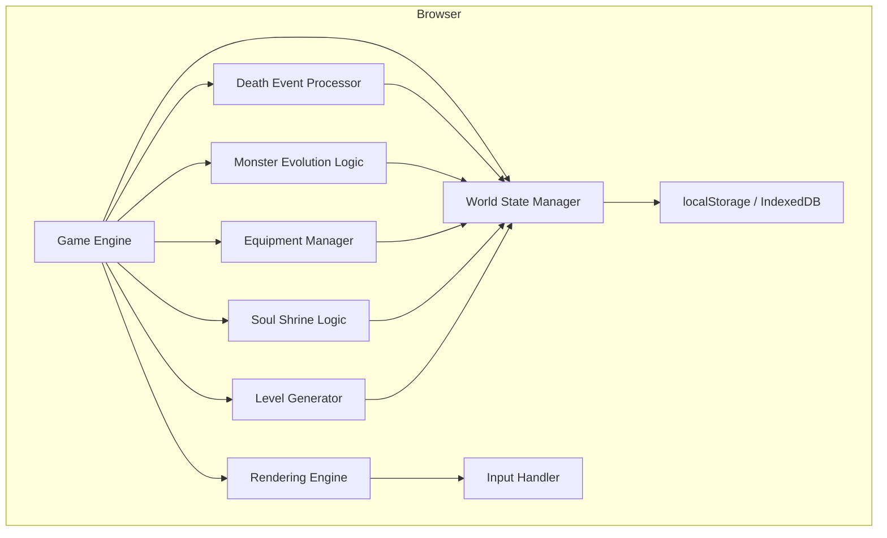
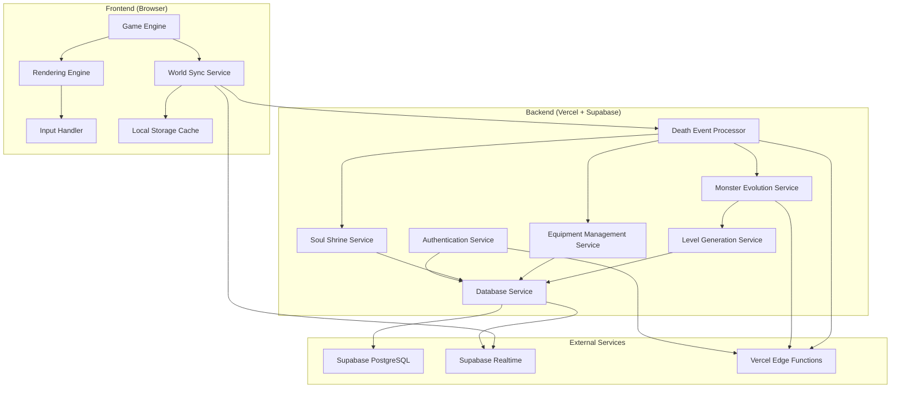

# Components

> **PHASE NOTE:** This document describes the full target architecture including cloud services. For Epics 1-4, all persistence is browser-local (localStorage/IndexedDB). Cloud components (Supabase, Vercel Functions, WebSockets, REST API) are deferred to Epic 5. Sections marked **(Epic 5)** do not apply to Epics 1-4.

## Game Engine

**Responsibility:** Core client-side game logic including combat, movement, inventory management, and local state coordination

**Key Interfaces:**
- GameState management and mutations
- Canvas rendering coordination
- Input processing and validation
- Local world state caching
- Real-time sync coordination

**Dependencies:** World Sync Service, Rendering Engine, Input Handler

**Technology Stack:** Vanilla TypeScript with custom state management, Canvas 2D API integration, shared data model interfaces

## Rendering Engine

**Responsibility:** ASCII character rendering using Canvas 2D with performance optimization for 60fps roguelike display

**Key Interfaces:**
- Canvas context management
- ASCII character atlas rendering
- Dirty rectangle optimization
- Screen layout coordination (map, inventory, stats panels)
- Green intensity color system

**Dependencies:** Game Engine (for game state), UI Component Library (for interface elements)

**Technology Stack:** Canvas 2D API with optimized character sprite rendering, CSS Modules for terminal styling, TypeScript for type-safe rendering logic

## World Sync Service **(Epic 5)**

> For Epics 1-4, this logic runs client-side within the Game Engine, persisting to localStorage.

**Responsibility:** Bidirectional synchronization between local game state and persistent world database

**Key Interfaces:**
- REST API client for immediate actions
- WebSocket client for real-time updates
- Local cache management
- Conflict resolution for offline/online state
- Event queue for deferred synchronization

**Dependencies:** Game Engine (for state updates), Backend API (for persistence), Local Storage (for offline cache)

**Technology Stack:** Fetch API for REST calls, WebSocket API for real-time events, IndexedDB for local caching, custom retry/queue logic

## Death Event Processor **(Epic 5)**

> For Epics 1-4, this logic runs client-side within the Game Engine, persisting to localStorage.

**Responsibility:** Server-side processing of hero deaths including monster promotion, equipment transfer, and shrine creation

**Key Interfaces:**
- Death event validation and processing
- Monster evolution queue management
- Equipment distribution algorithms
- Soul shrine placement logic
- World state mutation coordination

**Dependencies:** Database Service, Monster Evolution Service, Equipment Management Service

**Technology Stack:** Vercel serverless functions with TypeScript, Supabase PostgreSQL for persistence, event sourcing patterns

## Monster Evolution Service **(Epic 5)**

> For Epics 1-4, this logic runs client-side within the Game Engine, persisting to localStorage.

**Responsibility:** Managing monster promotions, kill tracking, and evolved monster queue system for infinite scaling

**Key Interfaces:**
- Monster promotion processing
- Kill history management
- Evolution queue prioritization
- Level population algorithms
- Stat enhancement calculations

**Dependencies:** Database Service, Level Generation Service

**Technology Stack:** TypeScript serverless functions, PostgreSQL for evolution tracking, queue management algorithms

## Level Generation Service **(Epic 5)**

> For Epics 1-4, this logic runs client-side within the Game Engine, persisting to localStorage.

**Responsibility:** Procedural dungeon generation with persistent layout storage and monster population management

**Key Interfaces:**
- Procedural layout algorithms
- Level persistence and caching
- Monster density calculations
- Chest and item placement
- Stairs and connectivity validation

**Dependencies:** Database Service, Monster Evolution Service

**Technology Stack:** TypeScript with procedural generation algorithms, PostgreSQL for level storage, caching strategies for frequently accessed levels

## Equipment Management Service **(Epic 5)**

> For Epics 1-4, this logic runs client-side within the Game Engine, persisting to localStorage.

**Responsibility:** Complex equipment constraints, blessing mechanics, and inventory validation across heroes and monsters

**Key Interfaces:**
- 10-slot equipment validation
- Blessing probability and enhancement
- Inventory overflow management
- Equipment naming and ownership tracking
- Stat calculation and bonuses

**Dependencies:** Database Service, Soul Shrine Service

**Technology Stack:** TypeScript with complex validation logic, PostgreSQL for equipment tracking, shared validation utilities

## Soul Shrine Service **(Epic 5)**

> For Epics 1-4, this logic runs client-side within the Game Engine, persisting to localStorage.

**Responsibility:** Soul shrine creation, placement queue management, and blessing interaction processing

**Key Interfaces:**
- Shrine creation from death events
- Queue-based placement algorithms
- Blessing probability calculations
- Equipment enhancement processing
- Shrine lifecycle management

**Dependencies:** Database Service, Equipment Management Service, Level Generation Service

**Technology Stack:** TypeScript serverless functions, PostgreSQL for shrine tracking, RNG algorithms for blessing mechanics

## Database Service **(Epic 5)**

> For Epics 1-4, this logic runs client-side within the Game Engine, persisting to localStorage.

**Responsibility:** Centralized data persistence with optimized queries for game performance and infinite scaling requirements

**Key Interfaces:**
- CRUD operations for all data models
- Complex relationship queries
- Transaction management for world changes
- Performance optimization and indexing
- Real-time subscription coordination

**Dependencies:** Supabase PostgreSQL, Supabase Realtime

**Technology Stack:** Supabase client libraries, PostgreSQL with optimized schemas, real-time subscriptions for live updates

## Authentication Service **(Epic 5)**

> For Epics 1-4, this logic runs client-side within the Game Engine, persisting to localStorage.

**Responsibility:** Player session management, hero ownership validation, and secure API access coordination

**Key Interfaces:**
- JWT token validation
- Player session management
- Hero ownership verification
- API request authorization
- Session persistence across devices

**Dependencies:** Database Service

**Technology Stack:** Supabase Auth with JWT tokens, middleware functions for API protection, session management utilities

## Component Diagrams

### Epics 1-4 Components (Local-Only)

### Full Architecture Components (Epic 5+)

---
