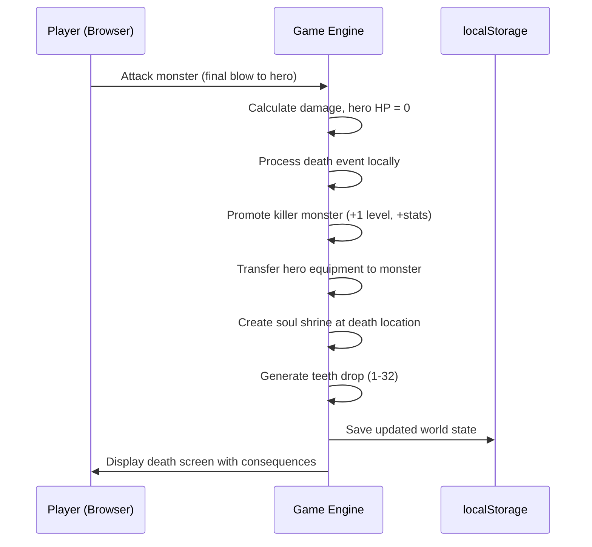
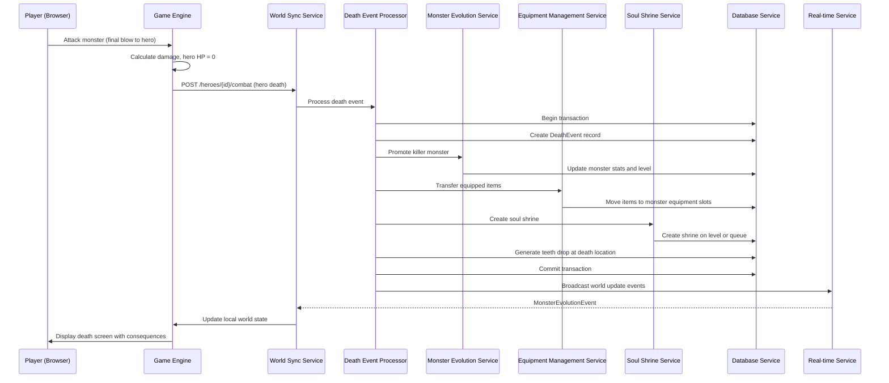
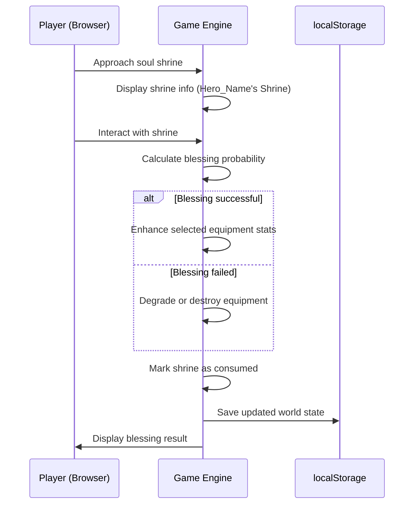
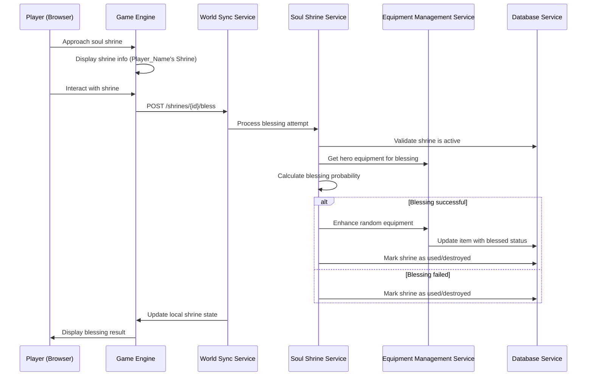
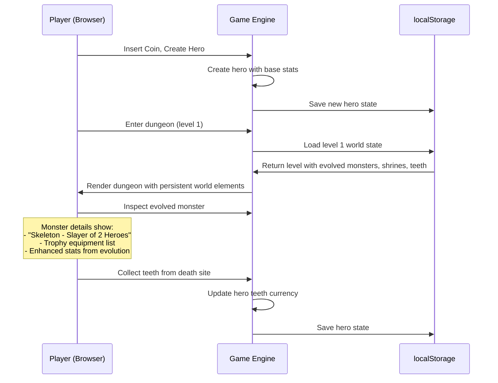
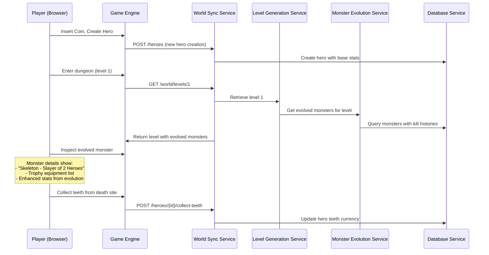

# Core Workflows

> **PHASE NOTE:** This document describes the full target architecture including cloud services. For Epics 1-4, all persistence is browser-local (localStorage/IndexedDB). Cloud components (Supabase, Vercel Functions, WebSockets, REST API) are deferred to Epic 5. Sections marked **(Epic 5)** do not apply to Epics 1-4.

## Hero Death and World Evolution Workflow

### Epics 1-4 (Local)

### Epic 5+ (Cloud)

## Soul Shrine Blessing Interaction Workflow

### Epics 1-4 (Local)

### Epic 5+ (Cloud)

## New Hero World Discovery Workflow

### Epics 1-4 (Local)

### Epic 5+ (Cloud)

---
