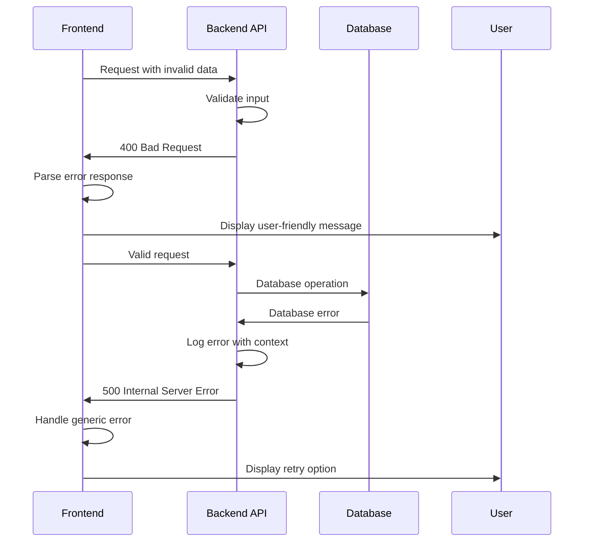

# Error Handling Strategy

## Error Flow



## Error Response Format

```typescript
interface ApiError {
  error: {
    code: string;
    message: string;
    details?: Record<string, any>;
    timestamp: string;
    requestId: string;
  };
}
```

## Frontend Error Handling

```typescript
class ErrorHandler {
  static handle(error: ApiError, context: string): void {
    // Log error for debugging
    console.error(`Error in ${context}:`, error);

    // Show user-friendly message
    const message = this.getUserMessage(error.error.code);
    toast.error(message);

    // Track error for monitoring
    analytics.track('error', {
      code: error.error.code,
      context,
      requestId: error.error.requestId
    });
  }

  private static getUserMessage(code: string): string {
    const messages: Record<string, string> = {
      'INSUFFICIENT_CREDITS': 'Not enough credits to create a new hero',
      'HERO_ALREADY_EXISTS': 'You already have an active hero',
      'INVALID_MOVEMENT': 'Cannot move to that location',
      'EQUIPMENT_SLOT_INVALID': 'Cannot equip item in that slot'
    };

    return messages[code] || 'Something went wrong. Please try again.';
  }
}
```

## Backend Error Handling

```typescript
export function errorHandler(error: Error, context: string): NextResponse {
  const requestId = crypto.randomUUID();

  // Log error with context
  console.error(`[${requestId}] Error in ${context}:`, {
    message: error.message,
    stack: error.stack,
    timestamp: new Date().toISOString()
  });

  // Determine error type and response
  if (error instanceof ValidationError) {
    return NextResponse.json({
      error: {
        code: 'VALIDATION_ERROR',
        message: error.message,
        details: error.details,
        timestamp: new Date().toISOString(),
        requestId
      }
    }, { status: 400 });
  }

  if (error instanceof AuthError) {
    return NextResponse.json({
      error: {
        code: 'UNAUTHORIZED',
        message: 'Authentication required',
        timestamp: new Date().toISOString(),
        requestId
      }
    }, { status: 401 });
  }

  // Generic server error
  return NextResponse.json({
    error: {
      code: 'INTERNAL_ERROR',
      message: 'Internal server error',
      timestamp: new Date().toISOString(),
      requestId
    }
  }, { status: 500 });
}
```

---
