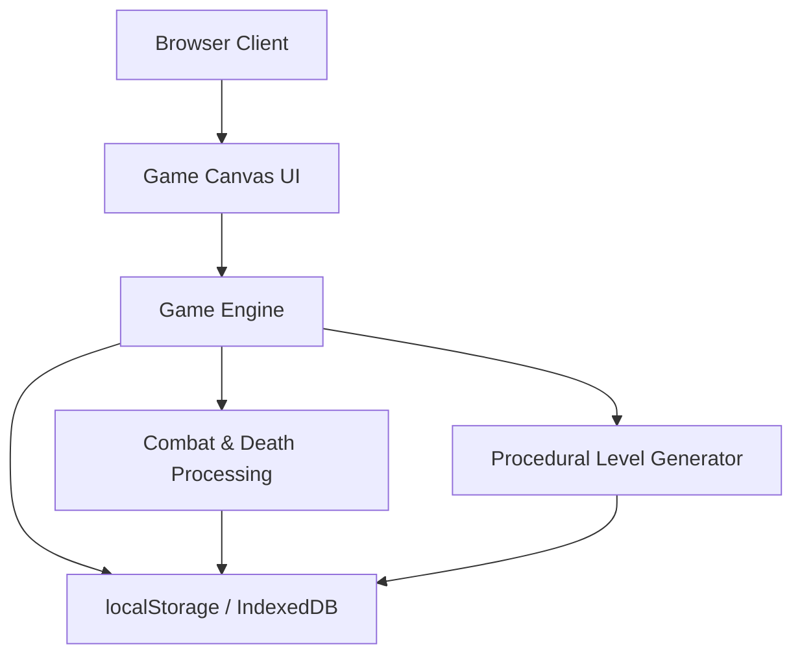
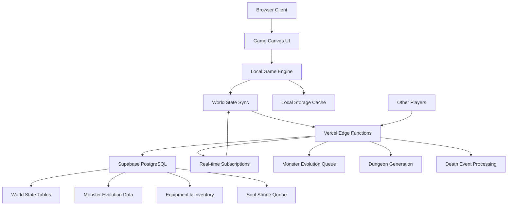

# High Level Architecture

> **PHASE NOTE:** This document describes the full target architecture including cloud services. For Epics 1-4, all persistence is browser-local (localStorage/IndexedDB). Cloud components (Supabase, Vercel Functions, WebSockets, REST API) are deferred to Epic 5. Sections marked **(Epic 5)** do not apply to Epics 1-4.

## Technical Summary

This architecture implements a **local-first roguelike** where all game mechanics and world persistence run client-side in the browser. For Epics 1-4, the game is a static Vite-built site using vanilla TypeScript with Canvas 2D rendering and localStorage for persistent world state. No backend server, database, or network calls are required.

In Epic 5, the architecture extends to a **hybrid online/offline model** combining the existing client-side game engine with server-side persistent world state via Vercel serverless functions and Supabase PostgreSQL, enabling cross-device play and multiplayer shared worlds.

The system prioritizes responsive local gameplay (sub-200ms input response). Core game mechanics execute client-side for optimal performance. This architecture supports unlimited scaling through efficient data structures, evolved monster queue management, and procedural content generation.

## Platform and Infrastructure Choice **(Epic 5)**

> For Epics 1-4, the game is a static Vite site deployed to any static host (Vercel, Netlify, GitHub Pages, or localhost). No backend infrastructure is needed. All persistence uses localStorage/IndexedDB.

**Platform:** Vercel (Frontend + Serverless Functions)
**Key Services:** Supabase PostgreSQL, Supabase Realtime, Vercel Edge Functions
**Deployment Host and Regions:** Global edge deployment via Vercel CDN

**Rationale:** Vercel + Supabase provides native TypeScript support, serverless functions ideal for event-driven game processing, real-time subscriptions for world state sync, and excellent developer experience for rapid iteration.

## Repository Structure

**Structure:** Monorepo with workspace-based organization
**Monorepo Tool:** npm workspaces (lightweight, no additional tooling complexity)
**Package Organization:** Clear separation between apps (game client, api), shared packages (types, utils), and configuration

## High Level Architecture Diagram

### Epics 1-4 Architecture (Local-Only)

### Full Architecture (Epic 5+)

## Architectural Patterns

- **Local-First Architecture:** Game mechanics execute client-side with background synchronization - _Rationale:_ Ensures responsive gameplay while maintaining persistent world state across sessions

- **Event Sourcing for World Changes:** Death events, monster promotions, and equipment transfers tracked as immutable events - _Rationale:_ Enables reliable world state reconstruction and debugging of complex evolution chains

- **Canvas-Based Rendering with Dirty Rectangles:** ASCII characters rendered using optimized Canvas 2D with selective updates - _Rationale:_ Achieves 60fps performance targets while maintaining authentic roguelike aesthetic

- **Queue-Based Monster Management:** Evolved monsters managed through priority queues for level population - _Rationale:_ Handles infinite scaling and complex monster evolution without performance degradation

- **Hybrid Online/Offline State** **(Epic 5):** Local state cache with eventual consistency synchronization - _Rationale:_ Supports offline play while ensuring world changes persist across devices and sessions

---
