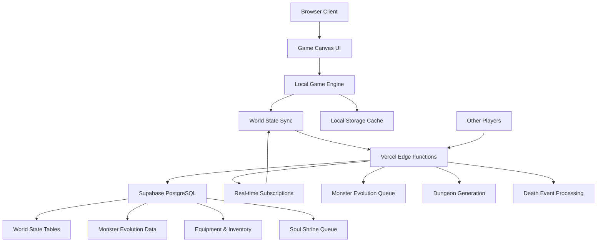

# High Level Architecture

## Technical Summary

This architecture implements a **local-first hybrid roguelike** combining client-side ASCII rendering with server-side persistent world state. The frontend uses vanilla TypeScript with optimized Canvas 2D rendering to achieve 60fps performance for traditional roguelike gameplay, while Vercel serverless functions and Supabase PostgreSQL maintain the innovative persistent world mechanics where player deaths create permanent monster evolutions and environmental changes.

The system prioritizes responsive local gameplay (sub-200ms input response) while seamlessly synchronizing world state changes across sessions and devices. Core game mechanics execute client-side for optimal performance, with strategic backend synchronization for world persistence, monster evolution tracking, and infinite dungeon generation. This architecture supports unlimited scaling through efficient data structures, evolved monster queue management, and procedural content generation.

## Platform and Infrastructure Choice

**Platform:** Vercel (Frontend + Serverless Functions)
**Key Services:** Supabase PostgreSQL, Supabase Realtime, Vercel Edge Functions
**Deployment Host and Regions:** Global edge deployment via Vercel CDN

**Rationale:** Vercel + Supabase provides native TypeScript support, serverless functions ideal for event-driven game processing, real-time subscriptions for world state sync, and excellent developer experience for rapid iteration.

## Repository Structure

**Structure:** Monorepo with workspace-based organization
**Monorepo Tool:** npm workspaces (lightweight, no additional tooling complexity)
**Package Organization:** Clear separation between apps (game client, api), shared packages (types, utils), and configuration

## High Level Architecture Diagram

## Architectural Patterns

- **Local-First Architecture:** Game mechanics execute client-side with background synchronization - _Rationale:_ Ensures responsive gameplay while maintaining persistent world state across sessions

- **Event Sourcing for World Changes:** Death events, monster promotions, and equipment transfers tracked as immutable events - _Rationale:_ Enables reliable world state reconstruction and debugging of complex evolution chains

- **Canvas-Based Rendering with Dirty Rectangles:** ASCII characters rendered using optimized Canvas 2D with selective updates - _Rationale:_ Achieves 60fps performance targets while maintaining authentic roguelike aesthetic

- **Queue-Based Monster Management:** Evolved monsters managed through priority queues for level population - _Rationale:_ Handles infinite scaling and complex monster evolution without performance degradation

- **Hybrid Online/Offline State:** Local state cache with eventual consistency synchronization - _Rationale:_ Supports offline play while ensuring world changes persist across devices and sessions

---
