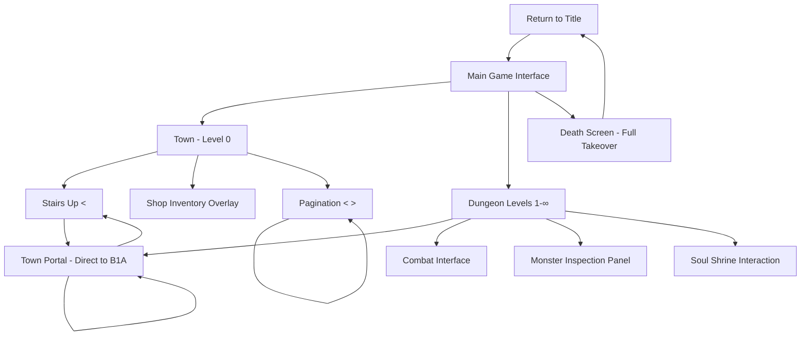
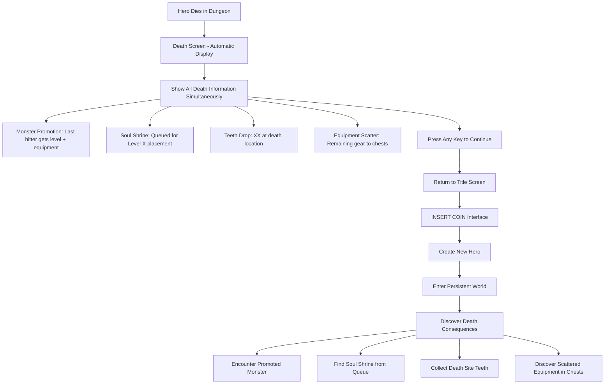
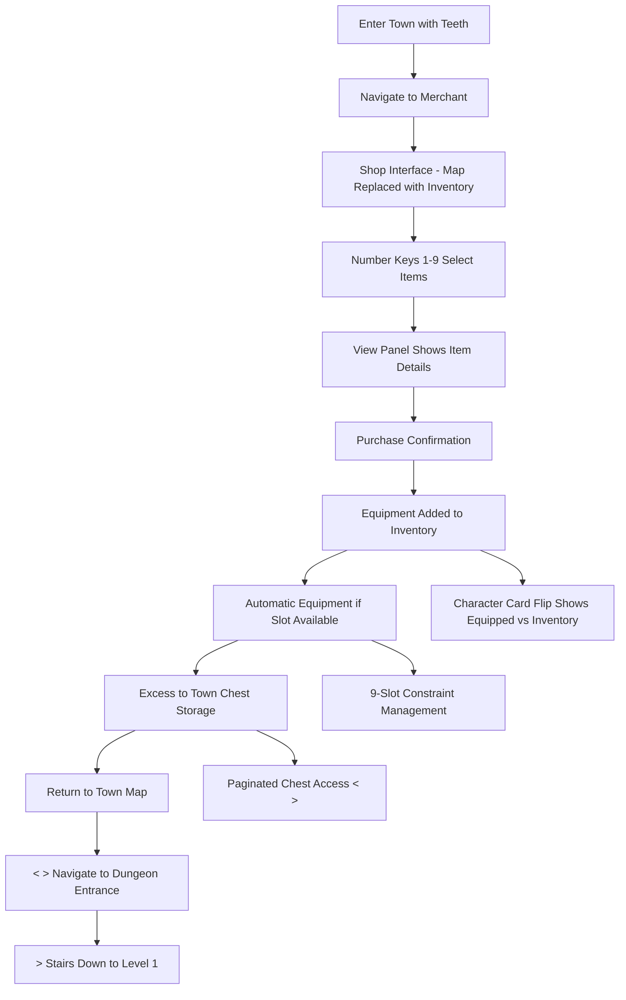

# Larn-Like Web3 Dungeon Crawler UI/UX Specification

*Generated using UI/UX Specification Template v2.0*
*Last Updated: 2025-09-28*

---

## Introduction

Based on the PRD, this document defines the user experience goals, information architecture, user flows, and visual design specifications for **Larn-Like Web3 Dungeon Crawler**'s user interface. It serves as the foundation for visual design and frontend development, ensuring a cohesive and user-centered experience.

The core UX challenge is communicating the innovative persistent world mechanics where player deaths become permanent world-building events through community-driven environmental storytelling. Each new hero discovers a world shaped by strangers' deaths, creating archaeological discovery rather than personal revenge narratives.

**Enhanced Death Screen Framework:**
```
Lvl 1 Player_Name slain by Lvl 1 Vampire Bat.
Player_Name dropped X teeth in death.
Lvl 1 Vampire Bat leveled up and descended deeper into the dungeon with Player_Name's Dagger.
The rest of Player_Name's belongings have been scattered by rats.
Player_Name's soul was trapped at Dungeon Level X.
Play again?
```

**Key UX Insights from User Journey Analysis:**
- **Fresh hero discovery** - Each character encounters artifacts and evolved monsters created by unknown previous players, fostering curiosity about world history
- **Community world-building** - Death contributes to shared environmental challenges rather than personal narrative threads
- **Archaeological engagement** - Finding "Sarah's Iron Sword" or "Marcus's Shield" creates historical flavor without personal attachment
- **Environmental storytelling** - Evolved monsters display kill counts and equipment as world lore, not personal vendetta targets

**Core UX Principles:**
1. **Clean slate psychology** - Every hero starts completely fresh with no connection to previous attempts
2. **Discovery-driven exploration** - Named equipment and evolved monsters tell stories of strangers, creating atmospheric depth
3. **Community consequence visibility** - Clear feedback showing how each death shapes the world for future players
4. **Immediate mechanical understanding** - Death screen education ensures players grasp the persistent world system from first death

### Overall UX Goals & Principles

#### Target User Personas

**Roguelike Veterans (Marcus)**
Technical professionals and dedicated gamers familiar with NetHack, Rogue, DCSS who appreciate keyboard-first ASCII gameplay and complex mechanics. They expect responsive controls, information density, and strategic depth. Skeptical of innovation unless it proves meaningful complexity.

**Curious Newcomers (Emma)**
Players attracted by innovative persistent world mechanics but new to traditional roguelikes. Need gentle guidance and clear feedback while discovering the ASCII aesthetic. Excited by revolutionary game concepts but require scaffolding to reach competency.

#### Usability Goals

**Universal Performance Standards:**
- **Responsive interaction:** Sub-200ms input response maintains fluid gameplay for veterans while providing immediate feedback for newcomers
- **Immediate death comprehension:** Both personas understand persistent world mechanics from first death screen experience

**Veteran-Specific Goals:**
- **Information accessibility:** All game data (monster stats, equipment, world state) immediately accessible through familiar hotkey patterns
- **Strategic depth validation:** Complex mechanics prove meaningful within 8-20 minutes of play

**Newcomer-Specific Goals:**
- **Basic competency achievement:** Successfully navigate, fight, and understand core loop within 5 minutes
- **Innovation appreciation:** "Aha!" moment recognizing death-as-world-building within 15 minutes of first play

#### Design Principles

**1. Dual-Track Information Architecture**
Design systems that serve both information-hungry veterans and newcomer guidance needs simultaneously. Core mechanics accessible without tutorials; optional contextual hints available on demand without disrupting experienced player flow.

**2. Authentic ASCII with Modern Clarity**
Honor 1980s terminal aesthetic while ensuring visual hierarchy and readability for newcomers. Balance nostalgic authenticity with accessibility requirements for diverse players.

**3. Death as Universal Teacher**
Transform traditional roguelike failure into positive world-building education. Death screen must satisfy both skeptical veterans seeking mechanical depth and confused newcomers needing emotional reframing.

**4. Progressive Complexity Revelation**
Reveal sophisticated systems (equipment, town, evolution) gradually through natural gameplay discovery rather than overwhelming initial presentations. Veterans discover through exploration; newcomers through guided experience.

**5. Performance-First Innovation**
Innovative persistent world mechanics must never compromise the responsive, fluid interaction that veterans demand and newcomers need for confidence building.

#### Change Log

| Date | Version | Description | Author |
|------|---------|-------------|---------|
| 2025-09-28 | v1.0 | Initial UX goals based on PRD analysis and persona journey mapping | Sally (UX Expert) |

---

## Information Architecture (IA)

### Site Map / Screen Inventory



### Navigation Structure

**Primary Navigation:** Context-sensitive `<` and `>` keys
- **Dungeon Context:** `<` = up levels (toward town), `>` = down levels (deeper)
- **Pagination Context:** `<` = previous page, `>` = next page
- **Emergency Exit:** Town Portal hotkey for direct Level X → Town escape

**Secondary Navigation:** Number keys (1-9) for item/inventory interaction
- **Inventory Management:** Direct hotkey access to carried items
- **Shop Interaction:** Number-based selection in merchant overlays
- **Equipment System:** Immediate equip/use through numbered inventory

**Breadcrumb Strategy:** Location display shows current context
- **Town:** "LOCATION: Town (Level 0)"
- **Dungeon:** "LOCATION: Dungeon Level X"
- **Shop:** "LOCATION: [Merchant Name] - Town"

---

## User Flows

### Complete Death-to-Restart Cycle

**User Goal:** Experience death as world-building contribution and start a new hero

**Entry Points:** Combat defeat in dungeon levels 1-∞ only (no town deaths)

**Success Criteria:** Player understands all death consequences through single automatic display, feels motivated to start new hero, new hero enters world with visible death consequences

#### Flow Diagram



#### Edge Cases & Error Handling:
- **Last Hit Attribution:** Simple last-damage-dealer logic determines monster promotion
- **Town Safety:** No deaths possible in Level 0, eliminates shrine/promotion edge cases
- **Shrine Queue System:** Failed placements queue for next map render, used shrines trigger queue replacement
- **Simultaneous Information:** All consequences displayed together, no timing complexity

### Equipment Management & Town Commerce

**User Goal:** Convert collected teeth into useful equipment and manage 9-slot inventory system

**Entry Points:** Return to town with accumulated teeth, inventory management during dungeon exploration

**Success Criteria:** Successfully purchase equipment using teeth currency, understand equipment slot constraints and management, efficiently transition between town commerce and dungeon exploration

#### Flow Diagram



### Soul Shrine Discovery & Blessing

**User Goal:** Discover soul shrines from previous deaths and attempt equipment blessing

**Entry Points:** Exploring dungeon levels where souls were trapped, systematic shrine hunting on specific levels

**Success Criteria:** Successfully identify and interact with soul shrines, understand blessing probability and equipment selection, feel rewarded regardless of blessing success/failure

#### Flow Diagram

```mermaid
graph TD
    A[Explore Level X] --> B[Discover Soul Shrine]
    B --> C[View Panel: "Player_Name's Shrine"]
    C --> D[Approach Shrine for Interaction]
    D --> E[Blessing Attempt Initiated]
    E --> F[RNG Blessing Calculation]
    F --> G{Blessing Success?}

    G -->|Yes| H[Random Equipment Enhanced]
    G -->|No| I[Blessing Failed - No Effect]

    H --> J[Equipment Gains Blessed Status + Mod]
    I --> K[Shrine Disappears After Use]
    J --> K
    K --> L[Shrine Queue Triggers Replacement]
    L --> M[Continue Exploration]

    B --> B1[Shrine from Death Queue]
    H --> H1[Equipment Naming: "Blessed Player_Name's Item"]
    J --> J1[Inventory Shows Enhanced Stats]
```

---

## Wireframes & Mockups

### Primary Design Files

**Design Tool Approach:** ASCII Layout Specifications rather than traditional graphical wireframes. Canvas-based rendering constraints and performance requirements drive specification format.

### Key Screen Layouts

#### Main Game Interface Layout

**Purpose:** Unified interface serving town, dungeon, and shop contexts with optimal information density

**ASCII Layout Specification (80x40 character grid):**

```
┌─LOCATION: Town (Level 0)──────TEETH: 247──HEALTH: ████████████─┐
├─────────────────────────────────┬─────────────────────────────────┤
│                                 │ VIEW PANEL: "You are in the     │
│         MAP SECTION             │ Town Square. You see a         │
│     (40x20 characters)          │ merchant's shop to the north."  │
│                                 │                                 │
│  ##################             │ SHRINE/MONSTER INSPECTION:      │
│  #                #             │ [Flip content for monster       │
│  #    @     M     #             │  details, shrine descriptions,  │
│  #                #             │  combat information]            │
│  #  S         T   #             │                                 │
│  ##################             │ (30x10 characters)              │
├─────────────────────────────────┼─────────────────────────────────┤
│ PLAYER STATS:                   │                                 │
│ Level: 3    STR: 12.4           │        INVENTORY                │
│ HP: 24/30   DEX: 8.1            │                                 │
│ Equipped: Iron Sword, Leather   │ 1. Blessed Dagger*              │
│                                 │ 2. Health Potion                │
│ CHARACTER CARD FLIP:            │ 3. Rat Tail                     │
│ [Toggle equipped vs inventory]  │ 4. [empty]                      │
│                                 │ 5. [empty]                      │
├─────────────────────────────────┤ 6. [empty]                      │
│ ACTION LOG:                     │ 7. [empty]                      │
│ > You entered the town          │ 8. [empty]                      │
│ > Skeleton slain for 15 XP      │ 9. [empty]                      │
│ > Found 3 teeth                 │                                 │
│ > Blessed Dagger enhanced!      │ (30x18 characters)              │
│                                 │                                 │
│ (40x10 characters)              │                                 │
└─────────────────────────────────┴─────────────────────────────────┘
```

**Key Elements:**
- **Status Bar:** Location, teeth currency, health bar (top 1 line)
- **Map Section:** Context-sensitive 40x20 area for town/dungeon/shop
- **View Panel:** 30x10 area for contextual descriptions and monster inspection
- **Player Stats:** 40x8 area with character card flip functionality
- **Action Log:** 40x10 scrolling combat/action history
- **Inventory:** 30x18 numbered item management with blessed item indicators

**Interaction Notes:**
- WASD/arrows for map movement
- `<`/`>` for stairs and pagination
- Number keys 1-9 for inventory interaction
- Character card flip key toggles equipped vs. carried items
- `?` for complete hotkey reference

#### Death Screen Layout

**Purpose:** Full-screen takeover for comprehensive death consequence display

```
┌─────────────────────────────────────────────────────────────────────┐
│                                                                     │
│                            HERO FALLEN                              │
│                                                                     │
│                                                                     │
│         Lvl 3 Sarah slain by Lvl 2 Vampire Bat                     │
│                                                                     │
│                                                                     │
│                        WORLD CONSEQUENCES:                          │
│                                                                     │
│         • Sarah's soul was trapped at Dungeon Level 2              │
│         • Sarah dropped 23 teeth at the site of death              │
│         • Lvl 2 Vampire Bat leveled up and descended deeper        │
│           into the dungeon with Sarah's Iron Sword                 │
│         • The rest of Sarah's belongings have been scattered       │
│           by rats and can be found in chests                       │
│                                                                     │
│                                                                     │
│                         LEGACY CREATED:                            │
│                                                                     │
│         • A shrine may appear on Level 2 that can bless            │
│           future heroes' equipment with mystical properties        │
│                                                                     │
│                                                                     │
│                                                                     │
│                  Press any key to return to title                  │
│                                                                     │
│                                                                     │
└─────────────────────────────────────────────────────────────────────┘
```

---

## Component Library / Design System

### Design System Approach

**Hybrid ASCII Component System** - Leverages established roguelike conventions for core gameplay elements while creating custom components specifically for innovative features (persistent world mechanics, teeth economy, soul shrines). This approach maintains veteran familiarity while ensuring newcomer accessibility and proper support for unique game systems.

### Core Components

#### Traditional Roguelike Components (Established Conventions)

**Movement & Exploration**
- **Purpose:** Character movement and map navigation using proven roguelike patterns
- **Variants:** WASD/Arrow keys/Numpad (player choice)
- **States:** Normal movement, combat locked, interaction mode
- **Usage Guidelines:** Follow NetHack/DCSS conventions for immediate veteran recognition

**Basic Combat Display**
- **Purpose:** Turn-based combat feedback using traditional roguelike messaging
- **Variants:** Hit/miss/damage display, monster death messages
- **States:** Player turn, monster turn, combat resolution
- **Usage Guidelines:** Maintain classic "You hit the skeleton for 3 damage" format

#### Innovation-Specific Custom Components

**Enhanced Status Bar**
- **Purpose:** Display location, teeth currency, and health with newcomer clarity
- **Variants:** Town mode, dungeon mode, shop mode context
- **States:** Normal, low health warning, teeth collection feedback
- **Usage Guidelines:** Prioritize readability over abbreviation; full words instead of cryptic codes

**Death Consequence Display**
- **Purpose:** Transform traditional death into world-building education
- **Variants:** Monster promotion, soul shrine creation, teeth generation
- **States:** Single comprehensive display with automatic timing
- **Usage Guidelines:** Celebratory framing, complete information, forced return to title

**Soul Shrine Component**
- **Purpose:** Interactive blessing stations created by trapped souls
- **Variants:** `+` symbol with player name attribution, blessing success/failure states
- **States:** Available, used (disappears), blessing in progress
- **Usage Guidelines:** Clear naming "Player_Name's Shrine", mystical but understandable

**Blessed Item Indicators**
- **Purpose:** Visual distinction for equipment enhanced by soul shrines
- **Variants:** `*` suffix for blessed status, enhanced stat display
- **States:** Normal item, blessed item, blessing enhancement visible
- **Usage Guidelines:** Subtle but clear marking, maintain equipment functionality

---

## Branding & Style Guide

### Visual Identity

**Brand Guidelines:** Authentic 1980s computer terminal aesthetic with green-on-black monochrome color scheme, using intensity variations (darker to lighter green to white) for visual hierarchy and element differentiation.

### Color Palette

| Color Type | Hex Code | Usage |
|------------|----------|-------|
| Background | #000000 | Screen background, authentic terminal black |
| Dark Green | #004000 | Dimmed elements, background text, less important info |
| Medium Green | #008000 | Standard game text, walls, floors |
| Bright Green | #00FF00 | Player character, important interactive elements |
| Light Green | #80FF80 | Highlighted text, focus indicators |
| White | #FFFFFF | Critical highlights, blessed items, shrine text |

### Typography

#### Font Families
- **Primary:** Monospace system fonts (Consolas, Monaco, "Courier New")
- **Fallback:** Generic monospace for maximum compatibility
- **Requirements:** Fixed-width characters for proper ASCII alignment

#### ASCII Character Standards

**Game Elements:**
```
@ - Player character (Bright Green #00FF00)
# - Walls (Medium Green #008000)
. - Floors (Dark Green #004000)
< - Stairs up (Medium Green #008000)
> - Stairs down (Medium Green #008000)
$ - Teeth currency (Light Green #80FF80)
+ - Soul shrines (White #FFFFFF)
```

**Items & Equipment:**
```
) - Weapons (Medium Green #008000)
[ - Armor (Medium Green #008000)
! - Potions (Light Green #80FF80)
* - Blessed items indicator (White #FFFFFF)
```

### Iconography

**Icon Library:** Extended ASCII character set with standard roguelike conventions

**Usage Guidelines:**
- Use standard roguelike symbols for immediate veteran recognition
- Apply intensity variations to show importance and state
- Blessed items use standard symbols + white (*) indicator
- Soul shrines use (+) symbol in white for maximum visibility

### Spacing & Layout

**Grid System:** Fixed character grid (80x40 minimum) with monospace font requirements

**Spacing Scale:** Single character spacing unit with box-drawing characters for borders and separation

---

## Accessibility Requirements

### Compliance Target

**Standard:** WCAG 2.1 AA Compliance with selective AAA features where achievable without compromising authentic roguelike experience.

### Key Requirements

#### Visual Accessibility

**Color contrast ratios:** All intensity levels exceed WCAG AA standards (7.6:1 to 21:1 ratios)

**Focus indicators:** Bright green (#00FF00) highlighting for keyboard navigation with clear visual distinction

**Text sizing:** Monospace fonts maintain layout integrity across browser zoom levels up to 200%

**Alternative color schemes:** Amber-on-black option available for users with green color vision deficiencies

#### Interaction Accessibility

**Keyboard navigation:** Complete game playability using only keyboard inputs - WASD/arrow movement, number keys for inventory, `<`/`>` for navigation, `?` for help

**Screen reader support:**
- Essential information always announced (health, combat, critical status)
- Interactive elements clearly identified with context
- Balanced detail level for gameplay efficiency
- Logical reading order through interface regions

**Touch targets:** Not applicable - keyboard-only interaction design eliminates touch/click requirements

#### Content Accessibility

**Alternative text:** ASCII symbols mapped to descriptive text for screen readers:
- `@` = "Player character"
- `+` = "Soul shrine"
- `*` = "Blessed item indicator"
- Monster letters = "Monster type, level, and evolution status"

**Heading structure:** Clear information hierarchy using screen reader heading navigation through game interface sections

**Form labels:** All interactive elements (inventory items, shop selections) have descriptive labels with context

### Testing Strategy

#### **Automated Testing (Weekly):**
- axe-core accessibility audit for HTML structure compliance
- WAVE browser extension for contrast and navigation validation
- Lighthouse accessibility scoring for performance benchmarks

#### **Screen Reader Testing (Monthly):**
- NVDA (Windows), JAWS (Windows), VoiceOver (Mac) compatibility testing
- Complete gameplay sessions using only screen reader output
- Navigation testing through all game areas and contexts

#### **User Testing with Disabled Gamers (Quarterly):**
- 3-5 participants with diverse accessibility needs
- 60-90 minute remote testing sessions with think-aloud protocol
- Focus on pain points, navigation confusion, and missing information

---

## Responsiveness Strategy

### Breakpoints

| Breakpoint | Min Width | Max Width | Target Devices |
|------------|-----------|-----------|----------------|
| Desktop | 1200px | - | Primary target: desktop browsers with full keyboard |
| Tablet | 768px | 1199px | Secondary support: tablets with external keyboards |
| Mobile | 320px | 767px | Limited support: touch interfaces with virtual keyboards |

### Adaptation Patterns

**Layout Changes:** ASCII character grid scales proportionally while maintaining aspect ratios and readability

**Navigation Changes:** Mobile interfaces prioritize touch-friendly hotkey alternatives while preserving keyboard shortcuts

**Content Priority:** Essential game information (health, location, inventory) remains visible across all screen sizes with secondary information collapsing as needed

**Interaction Changes:** Touch devices receive virtual keyboard overlays for essential hotkeys while maintaining primary keyboard navigation

---

## Animation & Micro-interactions

### Motion Principles

**Minimal Animation Philosophy** - ASCII roguelikes rely on character replacement and text updates rather than smooth animations. Motion limited to essential feedback: character position updates, text scrolling, and status changes.

### Key Animations

- **Character Movement:** Immediate position updates with no tweening (Duration: 0ms, authentic roguelike feel)
- **Combat Feedback:** Text-based damage display with brief highlighting (Duration: 500ms, Easing: none)
- **Screen Transitions:** Instant context switching between town/dungeon/shop modes (Duration: 0ms, maintains responsiveness)
- **Death Screen Transition:** Immediate full-screen takeover with no fade effects (Duration: 0ms, emphasizes finality)
- **Blessed Item Enhancement:** Brief white flash on blessing success (Duration: 200ms, Easing: none)

---

## Performance Considerations

### Performance Goals

- **Page Load:** Initial game load under 2 seconds on broadband connections
- **Interaction Response:** Sub-200ms input response for all keyboard actions
- **Animation FPS:** 60fps for ASCII character updates and screen redraws

### Design Strategies

**Canvas Optimization:** Pre-rendered character sprites for ASCII elements, dirty rectangle updates for changed screen regions only, efficient character grid rendering without unnecessary redraws

**Memory Management:** Lightweight ASCII data structures, level caching for recently visited dungeon areas, efficient monster evolution data storage

**Input Responsiveness:** Direct keyboard event handling without debouncing, immediate character position updates, optimized combat calculation performance

---

## Next Steps

### Immediate Actions

1. **Review specification with development team** for technical feasibility validation
2. **Create ASCII character atlas** with all required symbols and intensity variations
3. **Implement core canvas rendering system** with performance optimization for 60fps target
4. **Begin accessibility testing setup** with screen reader compatibility verification
5. **Establish color scheme implementation** with green intensity system and amber alternative

### Design Handoff Checklist

- [x] All user flows documented with edge cases and error handling
- [x] Component inventory complete with traditional and custom elements
- [x] Accessibility requirements defined with testing methodology
- [x] Responsive strategy clear for ASCII layout constraints
- [x] Brand guidelines incorporated with authentic terminal aesthetic
- [x] Performance goals established with specific technical targets

---

*UI/UX Specification Complete - Generated with Interactive Mode by Sally (UX Expert)*