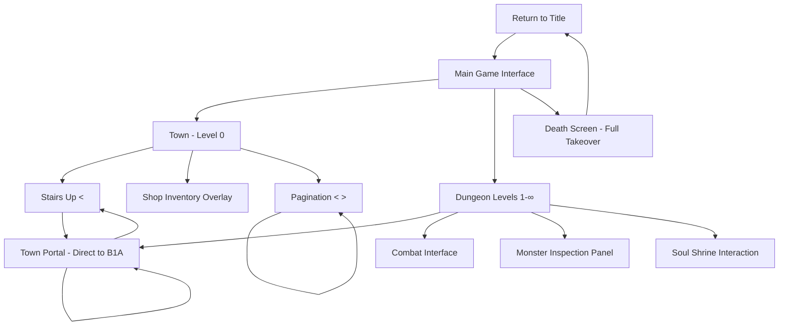

# Information Architecture (IA)

## Site Map / Screen Inventory

## Navigation Structure

**Primary Navigation:** Context-sensitive `<` and `>` keys
- **Dungeon Context:** `<` = up levels (toward town), `>` = down levels (deeper)
- **Pagination Context:** `<` = previous page, `>` = next page
- **Emergency Exit:** Town Portal hotkey for direct Level X → Town escape

**Secondary Navigation:** Number keys (1-9) for item/inventory interaction
- **Inventory Management:** Direct hotkey access to carried items
- **Shop Interaction:** Number-based selection in merchant overlays
- **Equipment System:** Immediate equip/use through numbered inventory

**Breadcrumb Strategy:** Location display shows current context
- **Town:** "LOCATION: Town (Level 0)"
- **Dungeon:** "LOCATION: Dungeon Level X"
- **Shop:** "LOCATION: [Merchant Name] - Town"

---
