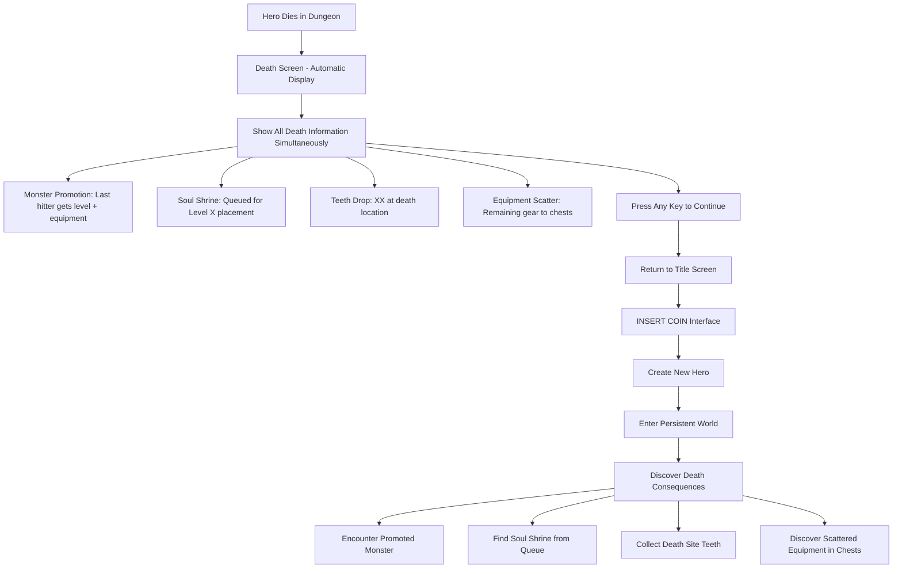
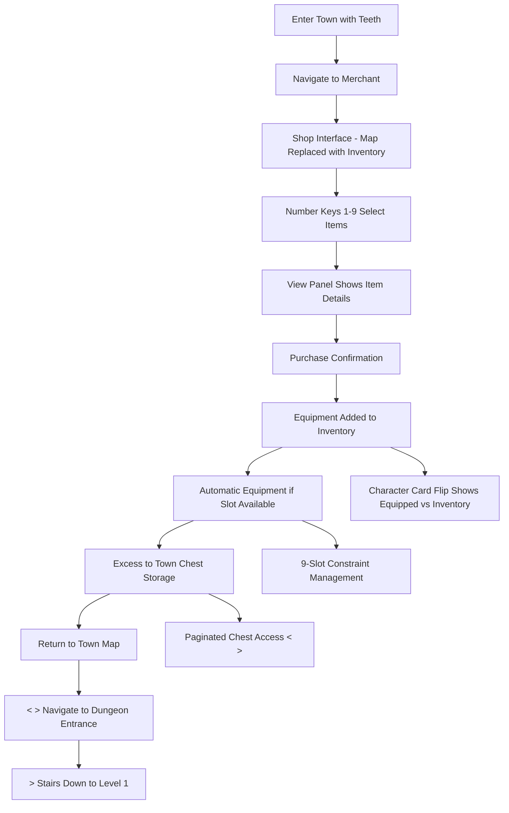

# User Flows

## Complete Death-to-Restart Cycle

**User Goal:** Experience death as world-building contribution and start a new hero

**Entry Points:** Combat defeat in dungeon levels 1-∞ only (no town deaths)

**Success Criteria:** Player understands all death consequences through single automatic display, feels motivated to start new hero, new hero enters world with visible death consequences

### Flow Diagram



### Edge Cases & Error Handling:
- **Last Hit Attribution:** Simple last-damage-dealer logic determines monster promotion
- **Town Safety:** No deaths possible in Level 0, eliminates shrine/promotion edge cases
- **Shrine Queue System:** Failed placements queue for next map render, used shrines trigger queue replacement
- **Simultaneous Information:** All consequences displayed together, no timing complexity

## Equipment Management & Town Commerce

**User Goal:** Convert collected teeth into useful equipment and manage 9-slot inventory system

**Entry Points:** Return to town with accumulated teeth, inventory management during dungeon exploration

**Success Criteria:** Successfully purchase equipment using teeth currency, understand equipment slot constraints and management, efficiently transition between town commerce and dungeon exploration

### Flow Diagram



## Soul Shrine Discovery & Blessing

**User Goal:** Discover soul shrines from previous deaths and attempt equipment blessing

**Entry Points:** Exploring dungeon levels where souls were trapped, systematic shrine hunting on specific levels

**Success Criteria:** Successfully identify and interact with soul shrines, understand blessing probability and equipment selection, feel rewarded regardless of blessing success/failure

### Flow Diagram

```mermaid
graph TD
    A[Explore Level X] --> B[Discover Soul Shrine]
    B --> C[View Panel: "Player_Name's Shrine"]
    C --> D[Approach Shrine for Interaction]
    D --> E[Blessing Attempt Initiated]
    E --> F[RNG Blessing Calculation]
    F --> G{Blessing Success?}

    G -->|Yes| H[Random Equipment Enhanced]
    G -->|No| I[Blessing Failed - No Effect]

    H --> J[Equipment Gains Blessed Status + Mod]
    I --> K[Shrine Disappears After Use]
    J --> K
    K --> L[Shrine Queue Triggers Replacement]
    L --> M[Continue Exploration]

    B --> B1[Shrine from Death Queue]
    H --> H1[Equipment Naming: "Blessed Player_Name's Item"]
    J --> J1[Inventory Shows Enhanced Stats]
```

---
